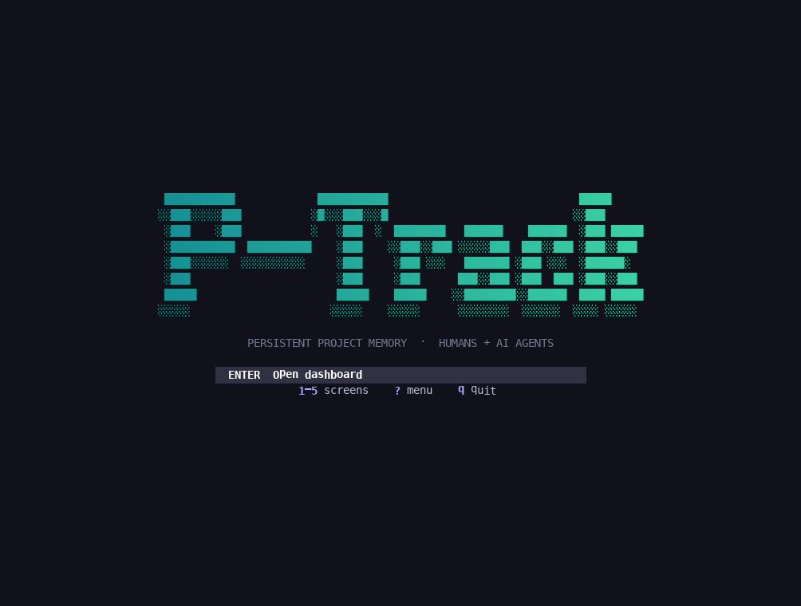
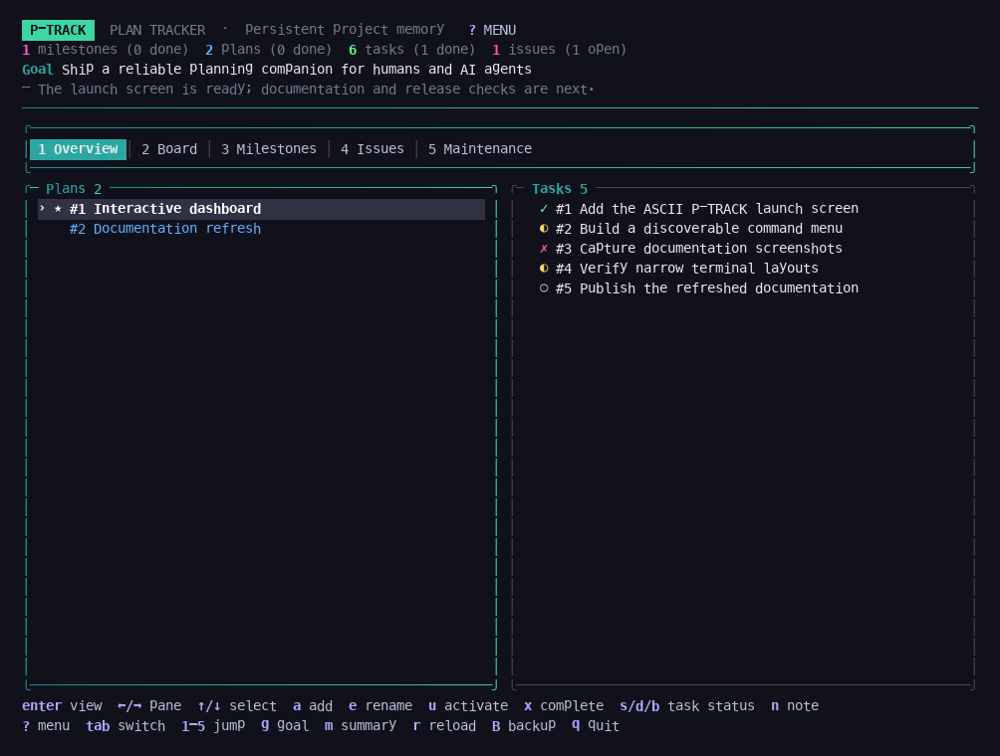
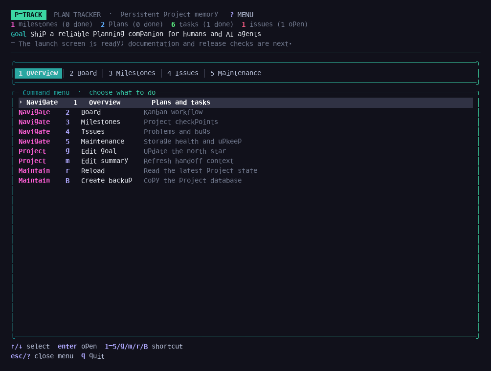
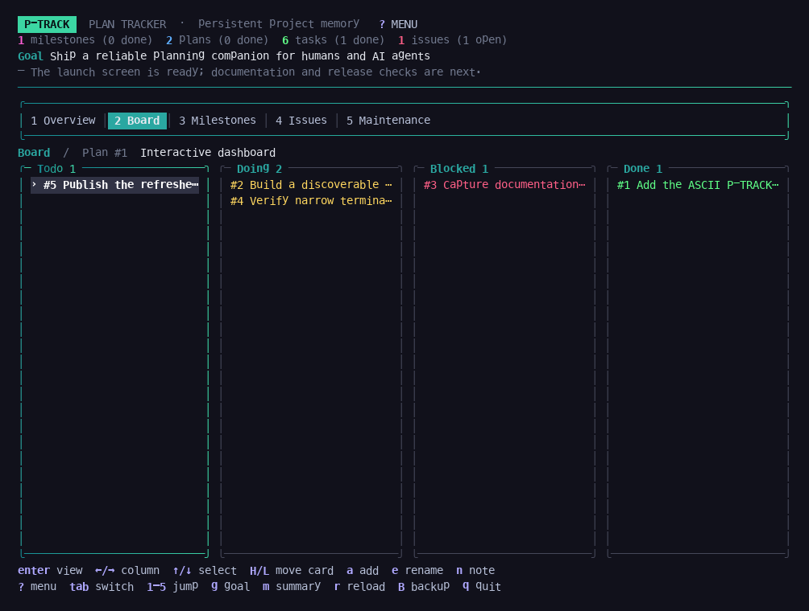
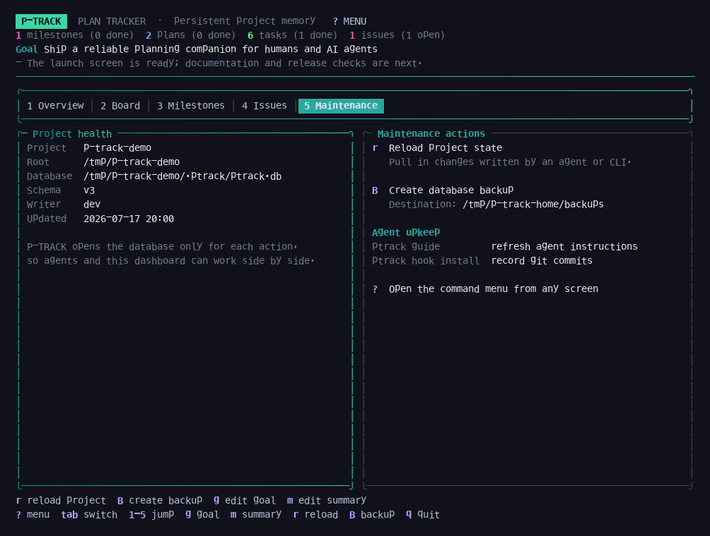

<div align="center">

# P-TRACK

### Persistent project memory for humans and AI agents

Keep goals, plans, tasks, decisions, issues, and commit context alive across
terminal sessions—without a server or a cloud account.

[](https://go.dev/)
[](https://github.com/ro-ag/ptrack/releases/tag/v0.11.0)
[](LICENSE)
[](#storage-and-safety)

</div>



P-TRACK gives one project two complementary interfaces:

- **Humans get a full-screen terminal dashboard.** Run `ptrack` to browse and
  edit the live project state, move work on a board, and perform maintenance.
- **Agents get small, scriptable commands.** Run `ptrack context` to restore a
  bounded handoff, then query or update only what the current task needs.

Both interfaces use the same embedded database. The TUI opens it only for each
action, so an agent and a human can work side by side without the dashboard
holding a long-lived lock.

## Contents

- [Install](#install)
- [Quick start](#quick-start)
- [The terminal dashboard](#the-terminal-dashboard)
- [Agent workflow](#agent-workflow)
- [Command reference](#command-reference)
- [Storage and safety](#storage-and-safety)
- [Development](#development)

## Install

Install the latest release with Go:

```sh
go install github.com/ro-ag/ptrack@latest
```

Or download a prebuilt binary from the
[GitHub releases page](https://github.com/ro-ag/ptrack/releases). Building from
source requires Go 1.26 or newer.

## Quick start

Initialize a project and give it a north star:

```sh
cd your-project
ptrack init --goal "Ship the widget service"
ptrack plan add "Build the storage layer"
ptrack plan use 1
ptrack task add "Define bbolt buckets" --plan 1
ptrack task start 1
ptrack note add "Chose bbolt over Badger" --task 1
```

Now choose the interface that fits the job:

```sh
ptrack          # human: open the interactive dashboard
ptrack context  # agent: restore a compact project handoff
ptrack next     # agent: ask for the single most-actionable task
```

Running `ptrack` outside an initialized project shows a branded getting-started
screen instead of a database error.

## The terminal dashboard

Bare `ptrack` opens a focused P-TRACK launch screen: a high-density Unicode
wordmark with one highlighted action and a few small shortcuts underneath.
Press `enter` to open the dashboard, `1`–`5` to jump directly to a screen, or
`?` to open the command menu. Narrow terminals fall back to a compact line-art
brand so the launch screen never overflows.



Inside the dashboard, the header becomes compact again. The numbered navigation
stays visible at the top, contextual actions stay visible at the bottom, and
`?` opens the command menu from any screen.



Use `↑`/`↓` and `enter` in the command menu, or press its shortcut directly.
The five main screens are also available with `1`–`5`:

| Key | Screen | What it is for |
|---:|---|---|
| `1` | **Overview** | Browse plans and their tasks; add, rename, activate, complete, or annotate work. |
| `2` | **Board** | See the active plan as Todo, Doing, Blocked, and Done columns. |
| `3` | **Milestones** | Review project checkpoints, their plans, due dates, and task rollups. |
| `4` | **Issues** | Track problems and bugs by severity and status. |
| `5` | **Maintenance** | Inspect project storage, reload concurrent changes, create backups, and review agent upkeep commands. |

### Work from the board

The board is a live kanban view of the selected plan. Move between columns with
`←`/`→`, select a card with `↑`/`↓`, and change its status with `H`/`L`.



Press `enter` on a plan, task, milestone, issue, or card to open its full item
view. Notes, linked entities, explanations, and recorded commits are shown in
scrollable nested panels; `enter` or `esc` returns to the dashboard.

### Keep the project healthy

Maintenance is a first-class screen instead of a hidden shortcut. It shows the
project root, database location, schema, last writer, and backup destination.



- `r` reloads changes written by an agent or another CLI process.
- `B` creates a timestamped database backup.
- `ptrack guide` refreshes the instructions installed for AI agents.
- `ptrack hook install` records git commits in the project audit trail.

### Keyboard map

| Scope | Keys |
|---|---|
| Launch screen | `enter` dashboard · `1`–`5` jump · `?` menu · `q` quit |
| Everywhere else | `?` menu · `tab`/`shift+tab` switch · `1`–`5` jump · `g` goal · `m` summary · `r` reload · `B` backup · `q` quit |
| Overview | `←`/`→` pane · `↑`/`↓` select · `a` add · `e` rename · `u` activate plan · `x` complete plan · `s`/`d`/`b` change task status · `n` note |
| Board | `←`/`→` column · `↑`/`↓` card · `H`/`L` move card · `a` add · `e` rename · `n` note |
| Milestones | `↑`/`↓` select · `a` add · `e` rename · `x` complete · `o` reopen |
| Issues | `↑`/`↓` select · `a` add · `e` rename · `c` close · `o` reopen |
| Item view | `↑`/`↓` scroll · `pgup`/`pgdn` page · `r` refresh · `enter`/`esc` back |

## Agent workflow

A fresh agent starts with `ptrack context`. The digest is intentionally bounded:
it restores the goal, rolling summary, active plan, blockers, open issues,
recent notes, and inventory without dumping the whole project.

```sh
ptrack context                # restore the live edge
ptrack next                   # choose the next task
ptrack task show 12           # drill into one item
ptrack note add "..." --task 12
ptrack task done 12
ptrack summary set "..."      # leave a compact handoff
```

Read commands render Markdown by default because it is compact for an LLM.
Add `--json` at automation boundaries.

### Agent onboarding

`ptrack init` installs a short, marker-delimited P-TRACK section into the
project's `AGENTS.md` and `CLAUDE.md`. Existing content is preserved, and
re-running `ptrack guide` updates only that managed section.

Use `ptrack init --no-guide` to skip guide installation. Personal working
agreements can live at `~/.ptrack/guide.md` or `$PTRACK_HOME/guide.md`; P-TRACK
appends them to the installed guide without changing the defaults shipped to
other users.

### Audit trail and commits

Notes are the human-visible record of what an agent did and why. Install the git
hook once with `ptrack hook install`; future commits are recorded automatically.
Put `#<task-id>` in a commit message to link the commit to that task.

## Command reference

| Command | Purpose |
|---|---|
| `ptrack init [--goal S] [--root D] [--force] [--no-guide]` | Create or refresh `.ptrack/` and the agent guide. |
| `ptrack guide [--print]` | Install, refresh, or print the agent guide. |
| `ptrack goal show\|set S` | Show or update the north-star goal. |
| `ptrack summary show\|set S` | Show or update the rolling context summary. |
| `ptrack milestone add\|list\|show\|done\|open\|due\|rename` | Manage checkpoints that group plans. |
| `ptrack plan add\|list\|show\|done\|use\|rename` | Manage plans; `show` includes tasks and notes. |
| `ptrack task add\|list\|show\|start\|done\|block\|rename` | Manage tasks; `list --status todo,doing,…` filters them. |
| `ptrack issue add\|list\|show\|close\|open\|severity\|rename` | Track issues and bugs, optionally linked to tasks. |
| `ptrack note add\|list` | Attach or list project, plan, and task notes. |
| `ptrack commit add\|list\|show\|record` | Browse the recorded git audit trail; `show` prints the diff. |
| `ptrack hook install` | Install the post-commit hook that records commits. |
| `ptrack context [--json]` | Print the bounded restore digest. |
| `ptrack next [--json]` | Print the most-actionable task in the active plan. |
| `ptrack board [--plan N] [--json]` | Print a plan's tasks grouped by status. |
| `ptrack search <term> [--json]` | Search plan and task titles plus note bodies. |
| `ptrack status [--json]` | Print a compact project overview. |
| `ptrack projects [--json]` | List projects in the global registry. |
| `ptrack backup` | Copy the current project database into global backups. |
| `ptrack version` | Print the P-TRACK version. |

Run `ptrack <command> --help` for flags and examples specific to a command.

## Storage and safety

P-TRACK is local-first and has no server process.

| Store | Location | Contents |
|---|---|---|
| Project | `.ptrack/ptrack.db` | Goal, summary, milestones, plans, tasks, issues, notes, and commit records. |
| Global | `~/.ptrack/global.db` | Configuration, the project registry, and backup metadata. |
| Backups | `~/.ptrack/backups/` | Timestamped copies created by `ptrack backup` or `B` in the TUI. |

Set `PTRACK_HOME` to move the global store and backups. Project discovery walks
upward from the current directory, similar to git. Values are encoded Go
structures stored in [bbolt](https://github.com/etcd-io/bbolt); JSON is produced
only when a command is explicitly asked for `--json` output.

## Development

```sh
go build ./...
go test ./...
```

Architecture and product design notes live in
[`docs/superpowers/`](docs/superpowers/).

## License

[Apache License 2.0](LICENSE) © 2026 ro-ag.
