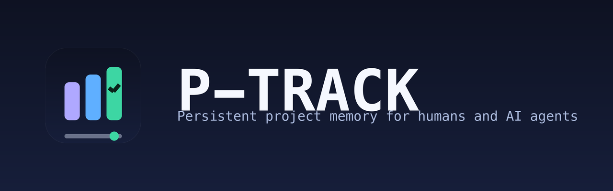
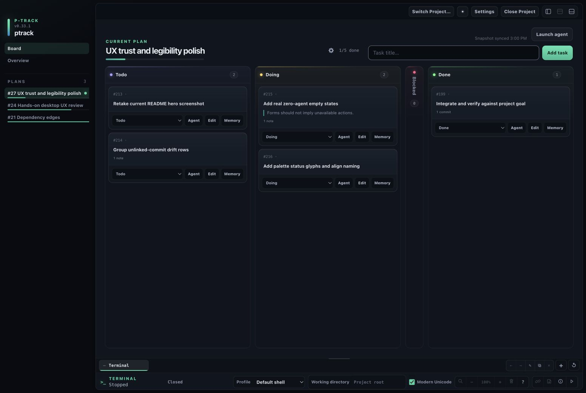
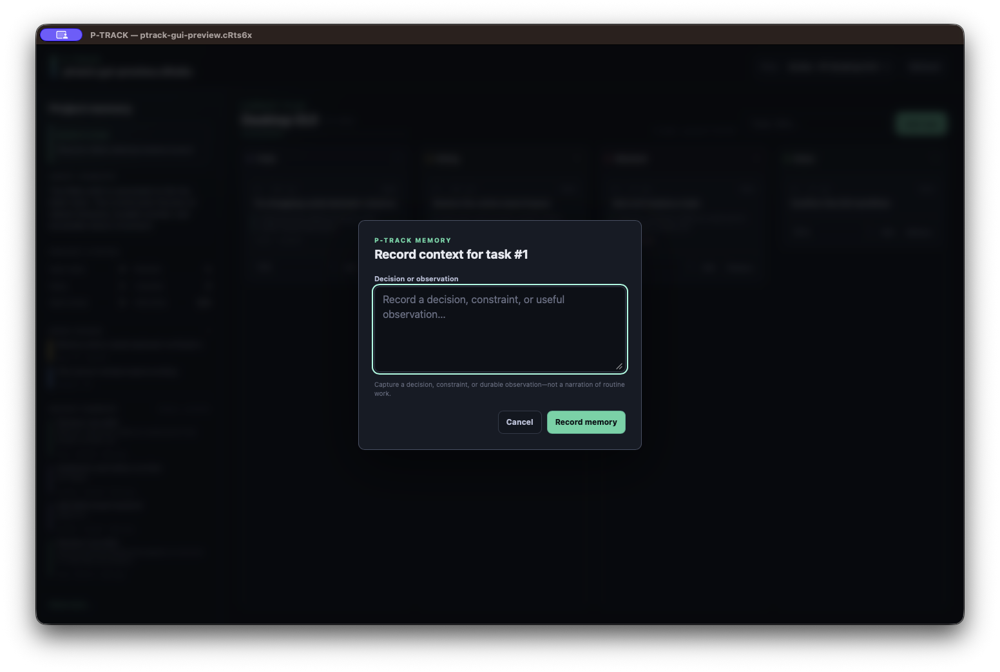
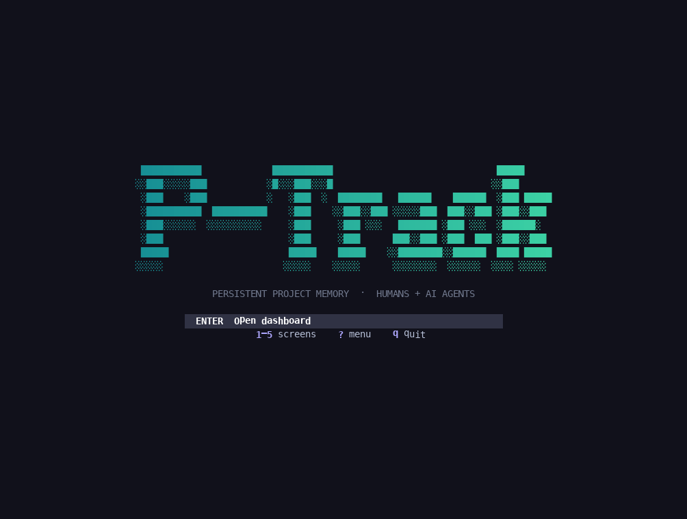
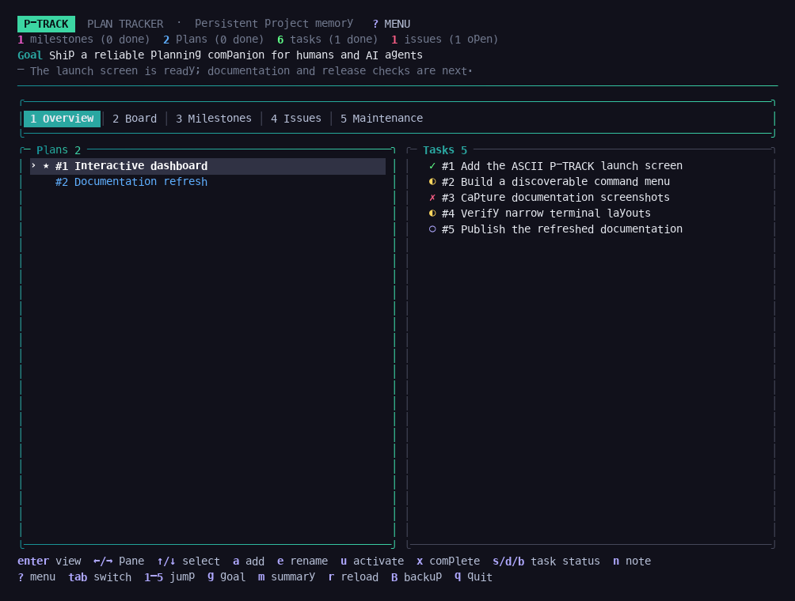
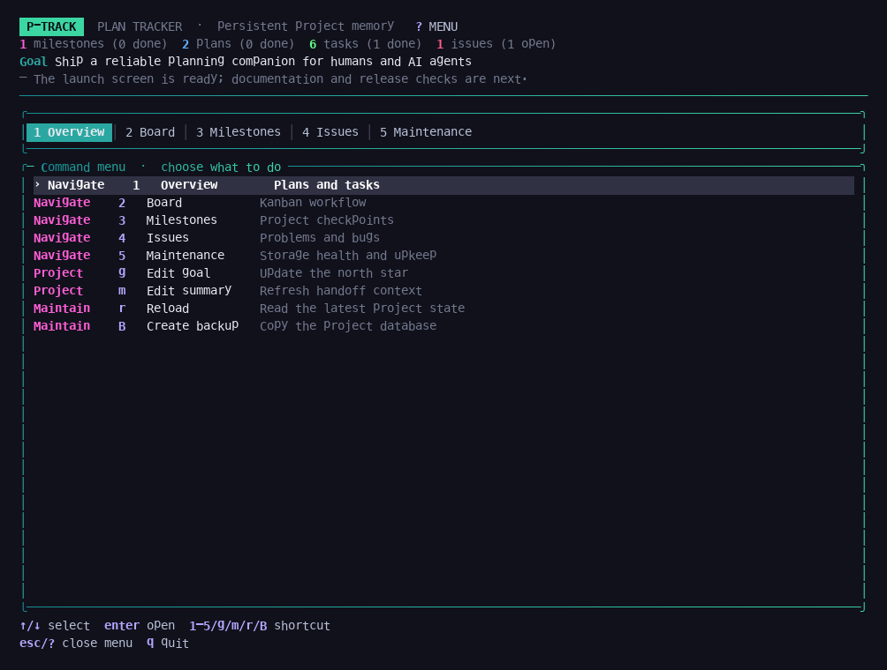
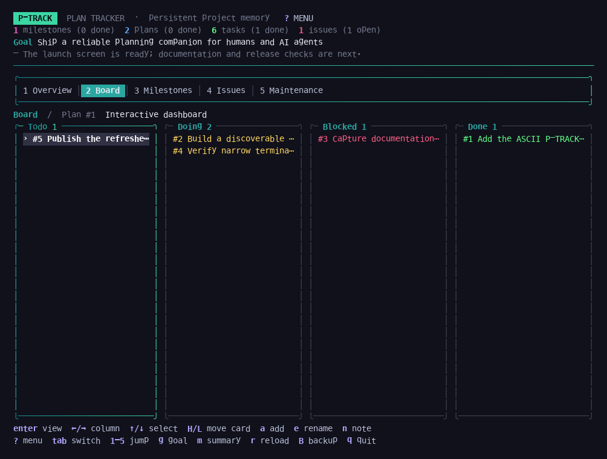
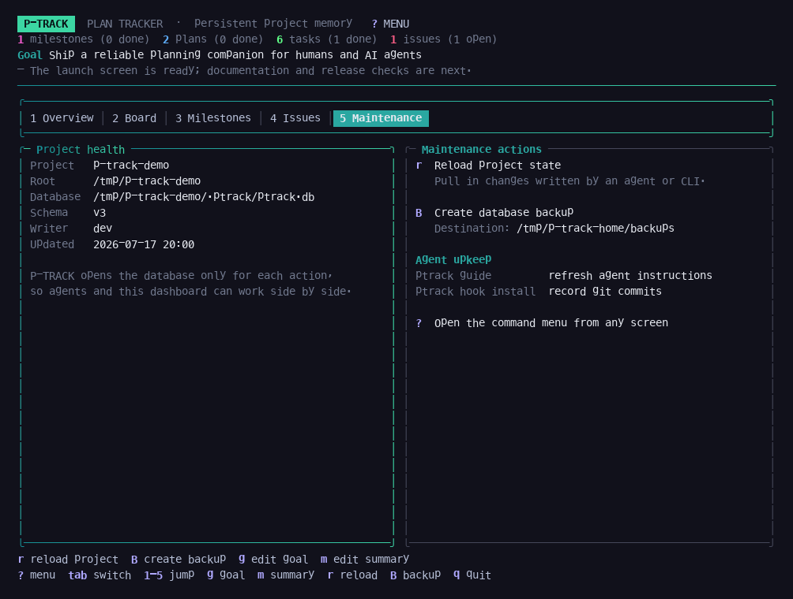

<div align="center">



Observe agent work, keep project state durable, and pass bounded context to
the next agent—without a hosted service or cloud account.

[](https://www.rust-lang.org/)
[](https://github.com/ro-ag/ptrack/releases/tag/v0.25.0)
[](https://ro-ag.github.io/ptrack/help/)
[](LICENSE)
[](#storage-and-safety)

</div>



p-track is a local control layer for work performed by humans and supported
coding-agent tools:

- **Observe.** The desktop workspace puts registered agent activity, task
  associations, repository state, advisory drift signals, terminals, and the
  Board in one project window.
- **Remember.** Goals, plans, tasks, decisions, issues, summaries, and commit
  context live in the repository's local p-track database instead of one
  vendor's conversation history.
- **Pass context.** A new agent can restore a bounded resume digest, inspect the
  active plan and its open tasks, and continue from durable notes. Desktop can
  also create reviewable, authority-free handoff proposals between registered
  live runs.
- **Run agents where the work is.** A multi-session terminal dock at the project
  root hosts PTY-backed shells and detected agent profiles alongside the board.
- **Deny by default.** HTTP, Git, and SSH capabilities are scoped to a single
  agent profile and project, previewed before they are enabled, and expire
  automatically.
- **Local-first, one binary.** No hosted service and no long-lived daemon—and
  over `ssh user@host` the terminal dashboard opens the same project.

The Desktop workspace is the primary surface. The full-screen terminal
dashboard and the scriptable CLI cover remote hosts, headless sessions, and
automation. All three share the same embedded database, and both the dashboard
and the GUI open it only for each action, so agents and humans can work side by
side without a long-lived lock.

## Contents

- [Install](#install)
- [Quick start](#quick-start)
- [The desktop project workspace](#the-desktop-project-workspace)
- [The terminal dashboard](#the-terminal-dashboard)
- [Updates](#updates)
- [Organize tasks](#organize-tasks)
- [Agent workflow](#agent-workflow)
- [Command reference](#command-reference)
- [Storage and safety](#storage-and-safety)
- [Development](#development)
- [License](#license)

## Install

Download the native archive for your platform from the
[GitHub releases page](https://github.com/ro-ag/ptrack/releases), then place the
`ptrack` executable somewhere on your `PATH`. Every release binary includes the
CLI, terminal dashboard, and Tauri desktop GUI.

On macOS you can instead download `p-track_<version>_darwin_<arch>.dmg` and drag
**p-track.app** into `/Applications`. Release disk images are Developer ID-signed,
notarized, and stapled by the tag workflow. The same executable inside the
bundle doubles as the CLI; symlink it onto your `PATH` with
`ln -s /Applications/p-track.app/Contents/MacOS/ptrack /usr/local/bin/ptrack`.

Building from source requires Rust 1.89, Node 24, and the
[Tauri prerequisites](https://v2.tauri.app/start/prerequisites/) for your
platform. No Go runtime or toolchain is required.

## Quick start

Initialize a project and give it a north star:

```sh
cd your-project
ptrack init --goal "Ship the widget service"
ptrack plan add "Build the storage layer"
ptrack plan use 1
ptrack task add "Define the storage schema" --plan 1
ptrack task start 1
ptrack note add "Chose redb for the storage layer" --task 1
```

Now choose the interface that fits the job:

```sh
ptrack gui      # human: open the desktop project workspace
ptrack          # human, over SSH or headless: open the terminal dashboard
ptrack context  # agent: restore a compact resume digest
ptrack next     # agent: ask for the single most-actionable task
```

Running `ptrack` outside an initialized project shows a branded getting-started
screen instead of a database error.

## The desktop project workspace

Use the Tauri GUI for the canonical native project workspace:

```sh
ptrack gui
ptrack gui ../another-project
ptrack board --gui          # compatible alias
ptrack board --gui --plan 4
```

Outside a project, the app opens a welcome screen with recent projects. Use the
native directory picker to open or switch projects, or close a project without
exiting the app. p-track confirms before a transition stops active terminals or
registered agent runs.

### Board and project memory

The project workspace combines a bounded tracking snapshot with repository and
storage status, read-only Git status/remotes/branches/commits/divergence,
multi-session terminals, and explicitly registered agent runs. Select a plan
from the sidebar, drag cards between Todo, Doing, Blocked, and Done, or use the
status selector on a card. Add tasks from the board header,
double-click a card to rename it, or record durable task context with **Memory**.
Cards surface linked notes, commits, and open issues, while the project-memory
rail keeps the goal, rolling project summary, status, issues, and recent decisions
in view. The board refreshes automatically while it is open; press `R` to reload
immediately after another process changes the project.



The GUI opens the database only for each action. The CLI and AI agents can
therefore keep reading and writing the same project without the board retaining
the database write lock.

### Registered agent runs

Registered agent runs keep a bounded on-disk history, so they survive app
restarts and project switches: a run interrupted by a restart comes back
marked stale instead of disappearing, and an external agent whose lease is
still valid resumes heartbeating on its own. Agents integrating over the local
API should treat the registry descriptor as stale when its hosting process is
gone — after a crash, wait for a fresh descriptor instead of dialling a dead
port.

An agent can be associated with an existing worktree only after p-track proves
that the canonical path belongs to the open repository's host-observed
worktree list. User-approved validation, commit, pull-request, and merge
workflow proposals are bound to the current lifecycle, association, worktree,
repository, source HEAD/status, and target OID; approval records the proposal
but executes no command, Git operation, hosting action, or capability grant.

### Structured agent events

Authenticated external wrappers can report structured activity to
`POST /v1/runs/<run-id>/events` with their run lease token. p-track-launched
agent profiles instead receive `PTRACK_AGENT_EVENT_ENDPOINT_V1` and a separate
`PTRACK_AGENT_EVENT_TOKEN_V1`; the token is unusable until the host binds the
successful launch to its AgentRun, is never a network-capability credential,
and is revoked before terminal teardown. The versioned input contains only an
event ID and sequence, an allowlisted type, short metadata, project-relative
paths, and commit or exit metadata. A free-text final-summary field is reserved
for trusted host-side integrations that explicitly enable it; generic provider
events cannot self-assert one. Codex, Claude, Gemini, Agy, and OpenCode have
provider adapters; unknown future providers are limited to explicit lifecycle
events. Provider event bodies reject unknown fields and do not admit prompts,
messages, reasoning, tool inputs or results, command arguments, terminal output,
transcripts, environment variables, request metadata, credentials, or project
associations.

p-track disables free-text summaries by default. An explicitly configured
integration may allow only final-summary events, which are treated as
untrusted, redacted, flattened, capped at 2 KiB, and rejected when they match
credential or reasoning content. It retains at most 128 structured events per
run for 14 days and revalidates retained events on restart. Project,
repository, terminal, plan, and task correlation always comes from the
host-owned run association. The desktop derives conservative
running/waiting/blocked/completed/failed/stale indicators from this evidence,
offers read-only context suggestions, and reports drift only from bounded,
observable Git and structured-event evidence. Explicit task ownership and
overlap warnings are advisory. Agent handoffs are bounded, single-use,
memory-only proposals that grant no authority and change no task.

### Capabilities

Settings also exposes deny-by-default HTTP, Git, and SSH capabilities scoped to
one agent profile and project. Preview and test the normalized scope before
enabling it. Approval expires automatically; request/response bodies, headers,
credentials, terminal contents, and raw arguments are excluded from the
bounded audit metadata.

### The terminal dock

The bottom dock hosts a multi-session terminal workspace at the project root.
Create tabs, split a tab horizontally or vertically, and resize panes while
each PTY-backed shell or detected agent profile remains live independently.
Only bounded layout descriptors persist; restored panes start stopped and mint
fresh runtime authority when restarted. Copy, paste, selection-aware `Ctrl+C`,
platform shortcuts, and the right-click terminal menu use the native clipboard.
Multiline text is held behind a bounded review dialog and sent through xterm's
bracketed-paste behavior only after confirmation. Exited sessions show their
status and can be restarted without reopening the board. Search the 25,000-line
scrollback with `⌘F` on macOS or `Ctrl+Shift+F` elsewhere, change the persisted
font size from the toolbar or standard zoom shortcuts, and clear or reset the
emulator without stopping its shell. WebGL rendering retries after a lost GPU
context and keeps xterm's built-in renderer as its fallback.

The top-right panel controls can independently hide the project sidebar, board,
or terminal; hiding the board gives the terminal the full workspace height
without restarting its session. The sidebar remains pointer- and
keyboard-resizable. **Modern Unicode** enables Unicode 15 grapheme and emoji
cell-width handling by default; turn it off from the terminal toolbar to return
to xterm's built-in compatibility mode.

### Terminal profiles

Terminal profiles can set renderer and launch policy without storing the
inherited process environment. Put a strict version-1 configuration at
`~/.ptrack/terminal-profiles.json` (or under `PTRACK_HOME`), then reopen the
project workspace. Each profile keeps its executable and argument array
separate and may set a named `default`, `platinum`, or `high-contrast` theme,
font family and size, bounded scrollback, explicit non-secret environment
overrides, `requested`/`project`/`fixed` working-directory policy, and
`keep`/`close-on-success`/`close` exit behavior. Toolbar zoom is remembered per
profile. Custom configured profiles are shells. An installed agent profile may
override only its name, renderer settings, scrollback, and exit behavior; its
executable, arguments, environment, provider, and working-directory policy must
stay identical so an existing capability approval cannot move to a different
process identity. For example:

```json
{
  "version": 1,
  "profiles": [
    {
      "id": "shell-focused",
      "name": "Focused shell",
      "kind": "shell",
      "executable": "/bin/zsh",
      "args": ["-l"],
      "env": {"EDITOR": "vim"},
      "theme": "high-contrast",
      "fontFamily": "Iosevka, monospace",
      "fontSize": 15,
      "scrollback": 50000,
      "cwdPolicy": "project",
      "exitBehavior": "keep"
    }
  ]
}
```

Profile files are private, atomically replaced, size-bounded, and strictly
decoded. `PTRACK_*` keys and credential-like environment names are rejected;
credentials still belong in the tool's native credential store, never in a
terminal profile. Automatic process restart is deliberately not an exit policy
because it would silently execute a fresh process with new runtime authority.

### Desktop keyboard shortcuts

| Action | macOS | Windows and Linux |
|---|---|---|
| Open project | `⌘O` | File → Open Project |
| Settings | `⌘,` | Project → Settings |
| Board / Overview / Capabilities | `⌘1` / `⌘2` / `⌘3` | `Ctrl+1` / `Ctrl+2` / `Ctrl+3` |
| Command palette | `⌘K` | `Ctrl+K` |
| Refresh board / add task | `R` / `/` | `R` / `/` |
| Toggle terminal panel | View → Toggle Terminal Panel | View → Toggle Terminal Panel |
| Close project | File → Close Project | File → Close Project |

Board and view shortcuts pause while a dialog is open or focus is in a text
control or terminal; the command palette shortcut remains global. Native menu
commands remain available when focus is retained, but never claim
`⌘W`/`Ctrl+W` or terminal control-key combinations.

### Platform verification status

Clipboard, shortcut, context-menu, restart, and shutdown interactions have been
verified on macOS. Windows and Linux archives include the native implementation,
but their PTY, clipboard, input, and descendant-process cleanup paths still
require interactive validation. Curses and mouse input, IME and Unicode,
sustained high-volume output, resize stress, and sleep/wake recovery also remain
in the manual acceptance matrix.

## The terminal dashboard

When the work happens on `ssh user@host`, a headless build box, or a tmux pane,
the terminal dashboard is the workspace. It reads and writes the same embedded
project database as the desktop app — the same goals, plans, tasks, milestones,
issues, and maintenance actions — with no display server and no port
forwarding.

Bare `ptrack` opens a focused p-track launch screen: a high-density Unicode
wordmark with one highlighted action and a few small shortcuts underneath.
Press `enter` to open the dashboard, `1`–`5` to jump directly to a screen, or
`?` to open the command menu. Narrow terminals fall back to a compact line-art
brand so the launch screen never overflows.



Inside the dashboard, the header becomes compact again. The numbered navigation
stays visible at the top, contextual actions stay visible at the bottom, and
`?` opens the command menu from any screen.



Use `↑`/`↓` and `enter` in the command menu, or press its shortcut directly.
The five main screens are also available with `1`–`5`:



| Key | Screen | What it is for |
|---:|---|---|
| `1` | **Overview** | Browse plans and tasks; add, edit, move, promote, complete, or annotate work. |
| `2` | **Board** | See the active plan as Todo, Doing, Blocked, and Done columns. |
| `3` | **Milestones** | Review project checkpoints, their plans, due dates, and task rollups. |
| `4` | **Issues** | Track problems and bugs by severity and status. |
| `5` | **Maintenance** | Inspect project storage, reload concurrent changes, create backups, and review agent upkeep commands. |

### Work from the board

The board is a live kanban view of the selected plan. Move between columns with
`←`/`→`, select a card with `↑`/`↓`, and change its status with `H`/`L`.



Press `enter` on a plan, task, milestone, issue, or card to open its full item
view. Notes, linked entities, explanations, and recorded commits are shown in
scrollable nested panels; `enter` or `esc` returns to the dashboard.

### Keep the project healthy

Maintenance is a first-class screen instead of a hidden shortcut. It shows the
project root, database location, schema, last writer, and backup destination.



- `r` reloads changes written by an agent or another CLI process.
- `B` creates a timestamped database backup.
- `ptrack guide` refreshes the instructions installed for AI agents.
- `ptrack hook install` records git commits in the project audit trail.

### Keyboard map

| Scope | Keys |
|---|---|
| Launch screen | `enter` dashboard · `1`–`5` jump · `?` menu · `q` quit |
| Everywhere else | `?` menu · `tab`/`shift+tab` switch · `1`–`5` jump · `g` goal · `m` summary · `r` reload · `B` backup · `q` quit |
| Overview | `←`/`→` pane · `↑`/`↓` select · `a` add · `e` edit · `M` move task to plan · `P` convert task to plan · `u` activate plan · `x` complete plan · `s`/`d`/`b` task status · `n` note |
| Board | `←`/`→` column · `↑`/`↓` card · `H`/`L` change status · `a` add · `e` edit · `M` move to plan · `P` convert to plan · `n` note |
| Milestones | `↑`/`↓` select · `a` add · `e` rename · `x` complete · `o` reopen |
| Issues | `↑`/`↓` select · `a` add · `e` rename · `c` close · `o` reopen |
| Item view | `↑`/`↓` scroll · `pgup`/`pgdn` page · `e` edit · `M` move task · `P` convert task to plan · `r` refresh · `enter`/`esc` back |

## Updates

The desktop app can check the stable releases published on the
[p-track GitHub repository](https://github.com/ro-ag/ptrack/releases). Open
**About & Updates** from the version in the sidebar, or choose
**Settings → Updates…** from the native menu. Manual checks work without an
open project. Automatic checks are off by default and contact GitHub only after
you opt in; they never download or install anything. Every download and
installation step requires a separate action.

The updater selects only the exact packaged asset for the running OS and CPU,
plus `checksums.txt`: a DMG on macOS, a ZIP on Windows, or a tarball on Linux.
GitHub's generated source archives, prereleases, development builds,
downgrades, arbitrary URLs, and ambiguous assets are rejected. Downloads are
size-bounded, staged privately, checked with SHA-256, and revalidated before
handoff. The release checksum detects corruption, but because it is published
by the same GitHub Release it is not an independent signature against a
compromised release account.

- **macOS:** p-track verifies the whole DMG, its Developer ID signature from the
  pinned p-track team, and Gatekeeper acceptance before opening it. Complete the
  app installation in Finder; the updater never replaces one file inside the
  signed app bundle.
- **Windows:** p-track verifies the ZIP and reveals it in Explorer. Close the
  running app before replacing the executable manually.
- **Linux:** p-track can atomically replace only the current standalone
  executable when it and its directory are safely owned and writable by the
  current user. It uses a rollback link, durable recovery record, version probe,
  and automatic rollback on failure. System-managed installations are refused
  rather than elevated with `sudo`.

Interrupted local stages are revalidated on the next launch. Ambiguous recovery
state blocks further update actions for manual attention. See
[`docs/updater-security.md`](docs/updater-security.md) for the complete trust and
failure model.

## Organize tasks

Move a task without recreating it:

```sh
ptrack task move 12 --plan 4
```

When a task grows into a workstream, convert it into a plan:

```sh
ptrack task convert 12
```

Conversion is atomic. The new plan keeps the task's title, creation time,
milestone, notes, and commits. A done task becomes a done plan; other task
statuses become an active plan. The original task is removed, and linked issues
are retained but unlinked because issues cannot target plans.

In the dashboard, select a task and press `M` to move it or `P` to convert it.
The same actions are available from `?` and from the task's item view.

Work that is paused on something external goes on hold with a reason:

```sh
ptrack task hold 12 waiting on the upstream schema decision
ptrack task resume 12
```

`ptrack plan hold|resume` does the same for a whole plan. A hold is orthogonal
to status: the item keeps its `todo`/`doing`/`blocked` status and its board
column, and simply gains a hold marker in the CLI, dashboard, and Desktop.
`ptrack next` skips held work, and `ptrack context` lists it separately so an
agent does not pick it up. `resume` clears the hold, and so does completing the
item: a task marked `done`, or a plan marked done or archived, drops its hold
automatically. Holds are set from the CLI; the interfaces display them.

## Agent workflow

A fresh agent—including a replacement using another supported agent tool—starts
with `ptrack context`. The digest is intentionally bounded: it restores the
goal, rolling summary, active plan, blockers, open issues, recent notes, and
inventory without dumping the whole project.

```sh
ptrack context                # restore the bounded resume digest
ptrack next                   # choose the next task
ptrack task show 12           # drill into one item
ptrack note add "..." --task 12
ptrack task done 12
ptrack summary set "..."      # update the rolling project summary
```

Read commands render Markdown by default because it is compact for an LLM.
Add `--json` at automation boundaries.

### Transfer work to another agent

The durable transfer path is the project record, not a provider session. Before
stepping away, leave the task status honest, attach decisions or blockers to the
relevant task or plan, and update the rolling summary with the current edge:

```sh
ptrack task show 12
ptrack note add "Blocked on the upstream schema decision" --task 12
ptrack summary set "Task #12 is blocked; schema options and evidence are in its notes."
```

The receiving agent—whether it uses the same tool or another supported
profile—starts from the repository and rechecks both p-track and Git before
continuing:

```sh
ptrack context
ptrack plan show 4
ptrack task show 12
git status --short
```

Plans have no exclusive agent owner. The CLI active plan is a project-wide
default, so use explicit plan and task IDs when multiple agents are working and
run `ptrack plan use <id>` only when you intend to change that shared default.
Task ownership shown in Desktop is advisory, not a lock.

This workflow transfers durable goals, plans, tasks, notes, summaries, and
recorded commit context. It does not transfer a provider transcript, hidden
reasoning, authentication, configuration, terminal state, or authority, and it
does not prove that an agent-maintained status is correct. The receiving agent
must reconcile stale status with the repository and current task evidence.

Desktop also supports a separate live handoff proposal between two registered
runs. That proposal is bounded, short-lived, authority-free, and visible in
p-track's inbox; it is not injected into either provider and does not update the
durable project record.

### Agent onboarding

`ptrack init` installs a short, marker-delimited p-track section into the
project's `AGENTS.md` and `CLAUDE.md`. Existing content is preserved, and
re-running `ptrack guide` updates only that managed section.

Use `ptrack init --no-guide` to skip guide installation. Personal working
agreements can live at `~/.ptrack/guide.md` or `$PTRACK_HOME/guide.md`; p-track
appends them to the installed guide without changing the defaults shipped to
other users.

### Audit trail and commits

Notes are the human-visible record of what an agent did and why. Install the git
hook once with `ptrack hook install`; future commits are recorded automatically.
Put `#<task-id>` in a commit message to link the commit to that task.

## Command reference

| Command | Purpose |
|---|---|
| `ptrack init [--goal S] [--root D] [--force] [--no-guide]` | Create or refresh `.ptrack/` and the agent guide. |
| `ptrack guide [--print]` | Install, refresh, or print the agent guide. |
| `ptrack goal show\|set S` | Show or update the north-star goal. |
| `ptrack summary show\|set S` | Show or update the rolling project summary. |
| `ptrack milestone add\|list\|show\|done\|open\|due\|rename` | Manage checkpoints that group plans. |
| `ptrack plan add\|list\|show\|done\|use\|rename\|hold\|resume` | Manage plans; `show` includes tasks and notes; `hold <id> <reason…>` pauses one. |
| `ptrack task add\|list\|show\|start\|done\|block\|rename\|move\|convert\|hold\|resume` | Manage tasks; move them between plans, convert them into plans, or put one on hold with a reason. |
| `ptrack issue add\|list\|show\|close\|open\|severity\|rename` | Track issues and bugs, optionally linked to tasks. |
| `ptrack note add\|list` | Attach or list project, plan, and task notes. |
| `ptrack commit add\|list\|show\|record` | Browse the recorded git audit trail; `show` prints the diff. |
| `ptrack hook install` | Install the post-commit hook that records commits. |
| `ptrack context [--json]` | Print the bounded resume digest. |
| `ptrack next [--json]` | Print the most-actionable task in the active plan. |
| `ptrack gui [PATH]` | Open the canonical desktop project workspace; PATH defaults to the current directory. |
| `ptrack board [--plan N] [--json] [--gui]` | Print a kanban board or open it as a Tauri desktop GUI. |
| `ptrack search <term> [--json]` | Search plan and task titles plus note bodies. |
| `ptrack status [--json]` | Print a compact project overview. |
| `ptrack projects [--json]` | List projects in the global registry. |
| `ptrack backup` | Copy the current project database into global backups. |
| `ptrack version` | Print the p-track version. |

Run `ptrack <command> --help` for flags and examples specific to a command.

## Storage and safety

p-track is local-first and requires no hosted service or long-lived daemon.
While Desktop is running, it exposes private loopback services for registered
agent integrations and explicitly approved broker capabilities.

| Store | Location | Contents |
|---|---|---|
| Project | `.ptrack/ptrack.redb` | Goal, summary, milestones, plans, tasks, issues, notes, capabilities, and commit records. |
| Global | `~/.ptrack/global.redb` | Configuration, the project registry, and backup metadata. |
| Runtime routing | `~/.ptrack/runtime/active-generation.json` | The attested generation and exact global/project store bindings. |
| Backups | `~/.ptrack/backups/` | Timestamped copies created by `ptrack backup` or `B` in the TUI. |
| Updates | `~/.ptrack/updates/` | Private verified release stages and bounded crash-recovery state. |

Set `PTRACK_HOME` to move the global store, backups, and update staging. The
persisted automatic-check opt-in is ordinary configuration in `global.redb`;
no GitHub credential or asset URL is stored. Runtime commands resolve only
stores named by the attested active-generation marker. JSON is produced only
when a command is explicitly asked for `--json` output.

## Development

The Rust/Tauri application builds one `ptrack` executable containing the CLI,
terminal dashboard, and desktop GUI. Install the
[Tauri prerequisites](https://v2.tauri.app/start/prerequisites/) for your
platform, then run:

```sh
make build
./target/$(rustc -vV | sed -n 's/^host: //p')/release/ptrack version
make test
```

The repository contains no Go runtime or source module.

On macOS, two more targets produce the branded desktop artifacts:

```sh
make package   # target/<triple>/release/bundle/macos/p-track.app
make archive   # exact updater-compatible macOS CLI tar.gz
make dmg       # exact p-track_<version>_darwin_<arch>.dmg
```

With a Developer ID identity in the login keychain (`SIGN_IDENTITY` is the
certificate SHA-1 fingerprint, found via `security find-identity -v -p
codesigning`):

```sh
make sign        # Developer ID signature: hardened runtime, entitlements,
                 # secure timestamp
make signed-dmg  # signed app + signed disk image (Gatekeeper still warns
                 # until notarized)
make release-dmg # full pipeline: sign, DMG, sign, notarize, staple — needs a
                 # one-time `xcrun notarytool store-credentials ptrack-notarize`
```

The tag-only release workflow runs the same steps for six native targets.
macOS release jobs fail closed unless the complete Developer ID and Apple
notary credential sets are present; unsigned macOS assets are never published.

Bundle configuration lives in `src-tauri/tauri.conf.json`; the frozen launcher
and hardened-runtime entitlements live in `build/darwin/`. Brand assets — the
icon generator, PNG exports, `AppIcon.icns`, README banner, and social card —
live in [`assets/brand/`](assets/brand/); regenerate them with `make icons`.

The equivalent command, for environments without `make`, is:

```sh
npm --prefix frontend ci
npm --prefix frontend run build
cargo build --locked --release --package ptrack-desktop --bin ptrack
```

Architecture and product design notes live in
[`docs/superpowers/`](docs/superpowers/). The approved all-Rust runtime, Tauri
boundary, storage activation contract, and fail-closed cutover design are
captured in [`docs/tauri-rust-recode.md`](docs/tauri-rust-recode.md).

## License

[Apache License 2.0](LICENSE) © 2026 ro-ag.
