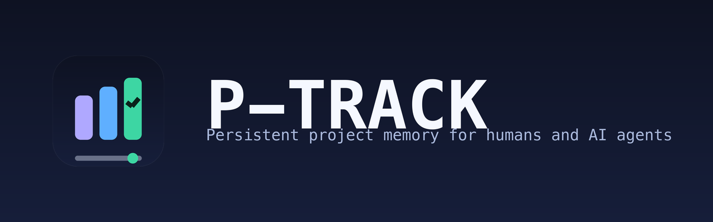
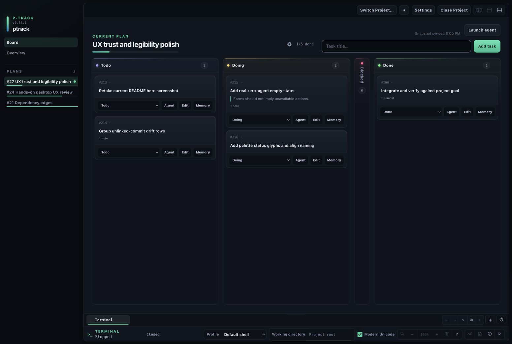
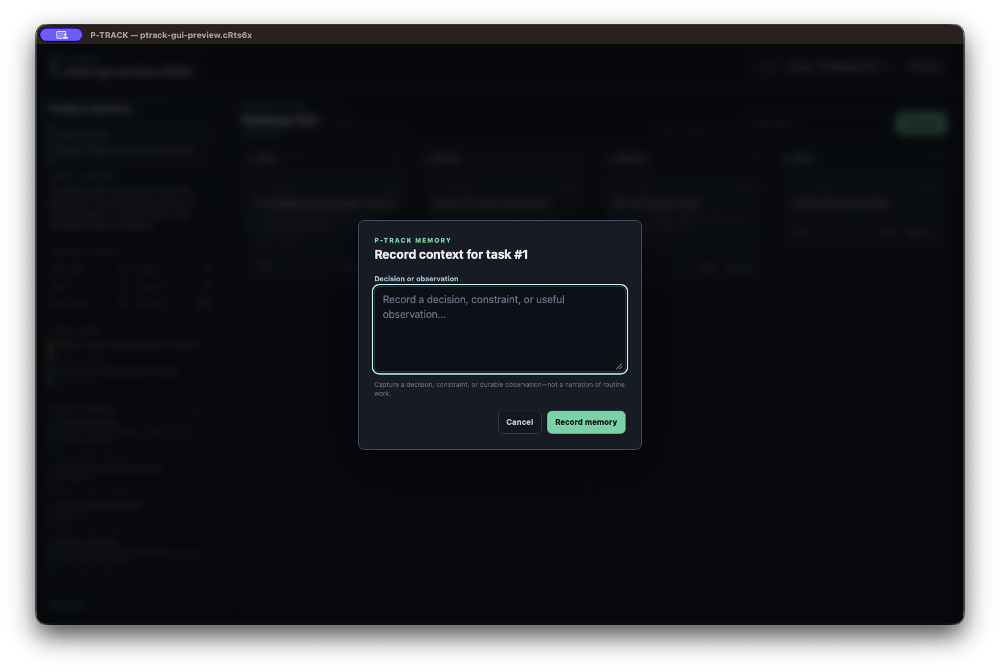
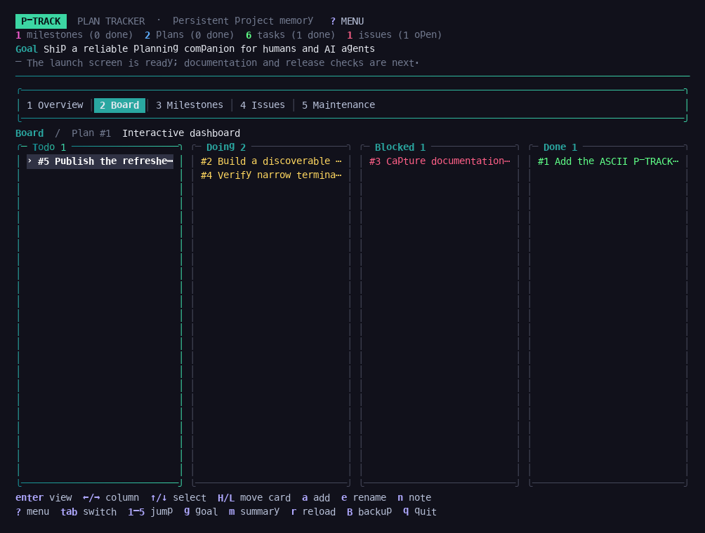

<div align="center">



Local project tracking for humans and coding agents.

[](https://www.rust-lang.org/)
[](https://github.com/ro-ag/ptrack/releases/tag/v0.45.0)
[](https://ro-ag.github.io/ptrack/help/)
[](LICENSE)

</div>



p-track keeps a project's goal, plans, tasks, issues, notes, and linked commits
in a database inside the repository (`.ptrack/`). Any agent, or you, can restore
a short resume digest and pick up where the last session stopped. Nothing is
hosted and no daemon runs.

One `ptrack` executable provides three interfaces over the same database:

- **Desktop app** (`ptrack gui`): Board, Issues, and Overview views, a terminal
  dock for shells and agent CLIs, Git state, and registered agent runs.
- **Terminal dashboard** (`ptrack`): a full-screen TUI for SSH sessions and
  headless machines.
- **CLI and MCP server**: scriptable commands with `--json`, plus `ptrack mcp`
  for MCP-capable agents.

Full documentation: **[Help Center](https://ro-ag.github.io/ptrack/help/)**.

## Contents

- [Install](#install)
- [Quick start](#quick-start)
- [Agent workflow](#agent-workflow)
- [Desktop app](#desktop-app)
- [Terminal dashboard](#terminal-dashboard)
- [Command reference](#command-reference)
- [Storage](#storage)
- [Updates](#updates)
- [Development](#development)

## Install

Download from the [releases page](https://github.com/ro-ag/ptrack/releases/latest).
Every package contains the CLI, the terminal dashboard, and the desktop app.

| Platform | Download | Notes |
|---|---|---|
| macOS (Apple silicon) | `p-track_<v>_darwin_arm64.dmg` | Signed and notarized. Drag to `/Applications`, then `ln -s /Applications/p-track.app/Contents/MacOS/ptrack /usr/local/bin/ptrack` for the CLI. |
| macOS CLI | `ptrack_<v>_darwin_arm64.tar.gz` | Bare executable. |
| Windows installer | `p-track_<v>_windows_<arch>.msi` | Per-user, no admin rights. Installs to `%LOCALAPPDATA%\Programs\p-track` and adds it to your user `PATH`. |
| Windows portable | `p-track_<v>_windows_<arch>_portable.exe` | Single file. Unpacks `ptrack.exe` once into `%LOCALAPPDATA%\p-track\portable\<sha256>\` and verifies it on every start. |
| Windows portable zip | `p-track_<v>_windows_<arch>_portable.zip` | `p-track.exe` (desktop) and `ptrack.exe` (CLI) side by side. |
| Windows CLI | `ptrack_<v>_windows_<arch>.zip` | Bare `ptrack.exe`. |
| Linux AppImage | `p-track_<v>_linux_<arch>.AppImage` | `chmod +x` and run. No arguments opens the desktop app; pass a command (`./p-track.AppImage status`) for the CLI. |
| Debian / Ubuntu | `p-track_<v>_linux_<arch>.deb` | `sudo apt install ./p-track_<v>_linux_<arch>.deb` |
| Fedora | `p-track_<v>_linux_<arch>.rpm` | `sudo dnf install ./p-track_<v>_linux_<arch>.rpm` |
| Linux CLI | `ptrack_<v>_linux_<arch>.tar.gz` | Needs GTK 3 and WebKitGTK 4.1 for `ptrack gui`. |

Windows and Linux builds are published for `amd64` and `arm64`. Windows needs
the WebView2 runtime, which ships with Windows 10 and 11. Linux packages target
glibc 2.35 or newer; musl systems are not supported. If FUSE is missing, run the
AppImage with `APPIMAGE_EXTRACT_AND_RUN=1`.

On NixOS, wrap the release AppImage without compiling:

```sh
nix-build build/linux --arg appimage "$PWD/p-track_0.45.0_linux_amd64.AppImage" \
  --argstr version 0.45.0
nix-env -i ./result     # optional: install with its desktop launcher
```

Each release ships a `checksums.txt` signed with the p-track Ed25519 key. To
verify a download from a checkout of this repository:

```sh
python3 tools/release_contract.py public-key release-public.der
openssl pkeyutl -verify -pubin -inkey release-public.der -keyform DER -rawin \
  -in checksums.txt -sigfile checksums.txt.sig
sha256sum --ignore-missing --check checksums.txt
```

Shell completions: `ptrack completion bash|zsh|fish|powershell`.

## Quick start

```sh
cd your-project
ptrack init --goal "Ship the widget service"
ptrack plan add "Build the storage layer"
ptrack plan list                      # note the plan ID
ptrack plan use <plan-id>
ptrack task add "Define the storage schema"
ptrack task list                      # note the task ID
ptrack task start <task-id>
ptrack note add "Chose redb for storage" --task <task-id>
```

`plan add` also creates an *Integrate and verify against \<goal\>* task in the
plan. `ptrack next` only offers it after the rest of the plan is done. Skip it
with `--no-verify-task`.

`init` also writes a short p-track section into the project's `AGENTS.md` and
`CLAUDE.md`, so agents know to use it. Other content in those files is left
alone. `ptrack guide` refreshes the section, and `--no-guide` skips it. Anything
in `~/.ptrack/guide.md` is appended to the section.

Then open the interface you need:

```sh
ptrack gui        # desktop app
ptrack            # terminal dashboard
ptrack context    # what an agent reads first
ptrack next       # the single most actionable task
```

## Agent workflow

An agent starts with `ptrack context`. It prints a bounded digest of the goal,
rolling summary, current plan, blockers, held and waiting work, open issues,
recent notes, and the project's detected stack. Every field is size-capped,
likely secrets are redacted, and the output is marked as untrusted data rather
than instructions.

```sh
ptrack context                        # resume digest
ptrack next                           # next task, led by the goal
ptrack task show 12
ptrack note add "..." --task 12
ptrack task done 12 --summary "what changed, where it is wired in"
ptrack summary set "..."              # update the rolling summary
```

Read commands print Markdown by default. Add `--json` for scripts.

### Gates

These checks enforce that work is actually finished before it is closed:

- **One task in progress.** While you have a started, unheld task,
  `task start`, `task add`, and `plan add` are refused. Finish it, or park it
  with `task hold <id> <reason>` or `task block <id> [reason]`.
- **Closing a task** needs `--summary` and at least one linked commit. Link a
  commit by putting `#<task-id>` in its message (with `ptrack hook install`), or
  with `ptrack commit record`.
- **Closing a plan** is refused while any of its tasks are open. After it
  closes, p-track prints a checkpoint block: goal, summary, open plans, issues,
  and milestones. `ptrack checkpoint` prints it on demand.

`--force` bypasses a gate in the CLI and over MCP, and writes an override note
on the record. The desktop app and the dashboard can close work without a
summary or commit, and they also write an override note.

### Holds and dependencies

```sh
ptrack task hold 12 waiting on the upstream schema decision
ptrack task resume 12
ptrack task dep add 12 9      # task 12 waits on task 9
ptrack plan dep add 4 2       # plan 4 waits on plan 2
```

A hold or dependency never changes a task's status. `next` skips held work and
work with open dependencies, and `context` lists them separately. Completing an
item clears its hold.

### Multiple agents or machines

Set a per-machine identity with `ptrack config set user <name>`. Then
`plan use <id>` claims the plan, and other users cannot change it until
it is released with `plan release <id>` or taken over with `plan use <id> --steal`.
Without an identity, there is one shared active plan.

To pass work to another agent, record it in the project: leave statuses
accurate, add notes to the task, and update the summary. The next agent runs
`ptrack context` and `git status`. Provider transcripts, credentials, and
terminal state are not transferred.

### MCP

`ptrack mcp` serves four tools over stdio for the project in its working
directory: `get_context`, `get_next_task`, `complete_task`, and `add_note`. The
write tools use the same gates as the CLI.

## Desktop app

```sh
ptrack gui                  # follows the startup preference (landing page by default)
ptrack gui ../other-project
```

- **Board.** Todo, Doing, Blocked, and Done columns for the current plan. Drag
  cards or use the card menu. Click a card to open its task drawer with notes,
  commits, and linked issues. The sidebar lists plans with progress. Selecting
  a plan makes it current, the same as `ptrack plan use`.
- **Issues.** Search, filter, edit, close, and reopen issues. Scheduling an
  issue into a plan creates and links a task in one step.
- **Overview.** Goal, summary, activity heatmap, Git status, branches and
  commits, the detected language stack, registered agent runs, handoffs, and
  drift warnings.
- **Landing page.** Totals and recent updates across all registered projects.
- **⌘K / Ctrl+K** searches plans, tasks, and notes. **Copy context** on a plan
  or task copies commands an agent can run to read it.



The app opens the database only for the duration of each action, so the CLI and
agents can write to the same project while the app is open.

### Terminal dock

The dock runs shells and agent CLIs at the project root:

- Tabs and horizontal or vertical splits.
- Scrollback search (25,000 lines by default) and font zoom.
- **Pop out terminal** moves a tab to its own window.
- A scratchpad keeps snippets you copy from a pane. Copied text is screened for
  secrets before it is kept.
- Multiline paste is shown for review before it is sent.

p-track detects installed agent CLIs and offers them as launch profiles: Claude,
Codex, Gemini, Kimi, OpenCode, Cursor Agent, and Agy. Use **Launch agent** on a
plan or task to start one linked to that work.

Custom profiles go in `~/.ptrack/terminal-profiles.json`:

```json
{
  "version": 1,
  "profiles": [
    {
      "id": "shell-focused",
      "name": "Focused shell",
      "kind": "shell",
      "executable": "/bin/zsh",
      "args": ["-l"],
      "env": {"EDITOR": "vim"},
      "theme": "high-contrast",
      "fontFamily": "Iosevka, monospace",
      "fontSize": 15,
      "scrollback": 50000,
      "cwdPolicy": "project",
      "exitBehavior": "keep"
    }
  ]
}
```

- `theme`: `default`, `platinum`, or `high-contrast`.
- `cwdPolicy`: `requested`, `project`, or `fixed`.
- `exitBehavior`: `keep`, `close-on-success`, or `close`.
- Environment keys that start with `PTRACK_` or look like credentials are
  rejected.

### Agent runs

Agents launched from the dock are registered automatically. External agents
can register too. Registered runs report structured events (lifecycle, touched
paths, commits, exit) to a loopback endpoint. Prompts, transcripts, and terminal
output are never accepted. From these events the app shows run status, warns
when work drifts from its task, and supports bounded handoff proposals between
live runs. `ptrack agent list|show|inbox` reads the same data from a terminal.
Optional OS notifications cover handoffs, failures, drift, and completion.

### Keyboard shortcuts

| Action | macOS | Windows / Linux |
|---|---|---|
| Open project | `⌘O` | `Ctrl+O` |
| Settings | `⌘,` | `Ctrl+,` |
| Overview / Board / Issues | `⌘1` / `⌘2` / `⌘3` | `Ctrl+1` / `Ctrl+2` / `Ctrl+3` |
| Search | `⌘K` | `Ctrl+K` |
| Toggle terminal | `⌘J` | `Ctrl+J` |
| Add task | `⌘N` or `/` | `Ctrl+N` or `/` |
| Search terminal | `⌘F` | `Ctrl+Shift+F` |
| Refresh | `R` | `R` |

## Terminal dashboard

Run `ptrack` with no arguments for a full-screen dashboard on the same
database. It works over SSH and inside tmux.



| Key | Tab |
|---:|---|
| `1` | **Overview**: plans and tasks; add, edit, move, convert, complete, annotate |
| `2` | **Board**: the current plan as columns |
| `3` | **Milestones**: checkpoints, due dates, and progress |
| `4` | **Issues**: issues by severity and status |
| `5` | **Maintenance**: storage details, reload, backup |
| `6` | **Agents**: live runs and handoffs from the desktop app |

| Scope | Keys |
|---|---|
| Everywhere | `?` menu · `tab`/`shift+tab` · `1`–`6` · `enter` details · `/` search · `g` goal · `m` summary · `e` rename · `r` reload · `B` backup · `q` quit |
| Overview | `h`/`l` pane · `j`/`k` select · `a` add · `n` note · `u` set current plan · `x` complete plan · `s`/`d`/`b` task status · `w` hold/resume · `M` move · `P` convert to plan |
| Board | `h`/`l`/`j`/`k` navigate · `H`/`L` move card · `a` add · `n` note · `w` hold/resume · `M` move · `P` convert |
| Milestones | `a` add · `x` complete · `o` reopen |
| Issues | `a` add · `c` close · `o` reopen · `v` cycle severity · `S` schedule into a plan |
| Search results | `j`/`k` select · `enter` open · `/` new search · `esc` close |
| Agents | `h`/`l` pane · `j`/`k` select · `enter` details |

Arrow keys also work wherever `h`/`j`/`k`/`l` do.

## Command reference

| Command | Purpose |
|---|---|
| `init [--goal S] [--root D] [--force] [--no-guide]` | Initialize `.ptrack/` and install the agent guide. |
| `guide [--print]` | Refresh or print the agent guide. |
| `goal show\|set`, `summary show\|set` | North-star goal and rolling summary. |
| `milestone add\|list\|show\|done\|open\|due\|rename` | Checkpoints that group plans (alias `ms`). |
| `plan add\|list\|show\|use\|release\|done\|rename\|hold\|resume\|delete\|move\|copy\|dep` | Plans. `move`/`copy --to <project>` transfers a plan and its tasks to another registered project. |
| `task add\|list\|show\|start\|done\|block\|rename\|move\|convert\|hold\|resume\|dep` | Tasks. `convert` (alias `promote`) turns a task into a plan. |
| `issue add\|list\|show\|edit\|close\|open\|severity\|rename\|schedule\|link\|unlink` | Issues. `schedule <id> --plan <id>` creates a linked task. |
| `note add\|list` | Project, plan, and task notes. |
| `commit add\|record\|list\|show` | Recorded commits. `show` prints the diff. |
| `hook install\|uninstall\|status` | Git post-commit hook that records commits. |
| `context`, `next`, `checkpoint` | Agent resume digest, next task, re-evaluation block. |
| `search <term>` | Search titles and notes. |
| `status`, `board [--plan N] [--gui]` | Project overview and kanban board. |
| `agent list\|show <run-id>\|inbox` | Live runs and handoffs from the desktop app. |
| `config set user <name>\|show` | Per-machine identity for plan claims. |
| `projects`, `backup` | Registered projects; back up the project database. |
| `relocate [--root D]` | Re-register a project whose folder was moved. |
| `local enable\|disable\|status`, `sync` | Project-local mode (below). |
| `gui [PATH]`, `mcp`, `completion <shell>`, `version` | Desktop app, MCP server, shell completions, version. |

Most read commands accept `--json`. Run `ptrack <command> --help` for details.

## Storage

| What | Where |
|---|---|
| Project database | `.ptrack/ptrack.redb` |
| Global config and project registry | `~/.ptrack/global.redb` |
| Backups (`ptrack backup`, `B` in the dashboard) | `~/.ptrack/backups/` |
| Terminal profiles, personal agent guide | `~/.ptrack/terminal-profiles.json`, `~/.ptrack/guide.md` |
| Update staging | `~/.ptrack/updates/` |

Set `PTRACK_HOME` to move everything under `~/.ptrack`.

**Project-local mode.** In sandboxes that restrict an agent to the project
directory, run `ptrack local enable` once from a normal shell. Project commands
then use only `.ptrack/`, and commands that need global state (backups, hooks,
desktop) say so. Run `ptrack sync` from a normal shell to refresh the project's
registration and summary, and `ptrack local disable` to switch back. Details are
in [docs/project-local-mode.md](docs/project-local-mode.md).

## Updates

Open **About & Updates** from the version label in the sidebar, or use **Check
for Updates…** in the app menu. Automatic checks are off until you enable them.
Downloads and installs always need a separate click.

The updater only accepts the stable GitHub release asset for your platform, and
only after `checksums.txt.sig` verifies against the public key built into p-track.

- **macOS:** verifies the DMG and its Developer ID signature, then opens it.
- **Windows MSI:** opens the next MSI, which upgrades in place.
- **Windows portable or CLI zip:** reveals the verified zip in Explorer for you
  to swap in.
- **Linux AppImage:** reveals the verified image for you to swap in.
- **Linux tarball:** replaces the executable in place, rolling back on failure.
- **deb / rpm / Nix:** shows that an update exists. Upgrade with your package manager.

See [docs/updater-security.md](docs/updater-security.md) for the trust model.

## Development

Requires Rust 1.89, Node 24, and the
[Tauri prerequisites](https://v2.tauri.app/start/prerequisites/).

```sh
make build        # frontend + release binary
make test         # fmt, tests, clippy, docs, Help Center checks
./target/$(rustc -vV | sed -n 's/^host: //p')/release/ptrack version
```

On NixOS, `nix-shell` provides the full toolchain. Run the built binary inside
that shell.

On Ubuntu:

```sh
sudo apt-get install build-essential pkg-config libgtk-3-dev libwebkit2gtk-4.1-dev \
  libayatana-appindicator3-dev librsvg2-dev patchelf
```

Packaging:

```sh
make linux-package VERSION=0.45.0       # AppImage, deb, rpm, tarball into dist/ (Docker)
make linux-package-test VERSION=0.45.0
make dmg                                # macOS, unsigned
make release-dmg                        # macOS: sign, notarize, staple
pwsh build/windows/package.ps1          # Windows MSI, portable exe and zip
```

Releases are built by `.github/workflows/release.yml` when a `v*` tag is
pushed.

<details>
<summary>Linux graphics notes</summary>

- With the NVIDIA driver loaded, startup sets
  `WEBKIT_DISABLE_DMABUF_RENDERER=1` to avoid blank windows. Set it to `0` to
  override.
- AppImages run under X11/XWayland. deb and rpm packages also support native
  Wayland.
- Check out the repository on a Linux filesystem. exFAT breaks `npm ci`
  symlinks.

</details>

### Architecture

```text
ptrack CLI ------------+
ptrack TUI ------------+--> ptrack-app --> ptrack-store --> redb
Tauri WebView --> IPC -+        |
                                +--> ptrack-git / ptrack-agent / ptrack-terminal
                                +--> ptrack-updater
```

| Crate | Owns |
|---|---|
| `src-tauri/` | Desktop shell, menus, IPC adapter; builds the `ptrack` binary |
| `crates/ptrack-core` | Models, validation, search, reports |
| `crates/ptrack-store` | redb schema, transactions, paths, backups |
| `crates/ptrack-app` | Use cases shared by CLI, TUI, and desktop; MCP server |
| `crates/ptrack-cli` | Command parsing and output |
| `crates/ptrack-tui` | Terminal dashboard |
| `crates/ptrack-git` | Repository and worktree inspection |
| `crates/ptrack-agent` | Agent runs, events, handoffs, drift |
| `crates/ptrack-terminal` | PTYs, profiles, shell integration |
| `crates/ptrack-updater` | Release discovery, verification, install handoff |
| `crates/ptrack-launcher` | Windows `p-track.exe`: starts the desktop app without a console |
| `crates/ptrack-portable` | Windows single-file portable wrapper |

Design notes live in [docs/](docs/).

## License

[Apache License 2.0](LICENSE) © 2026 ro-ag.
