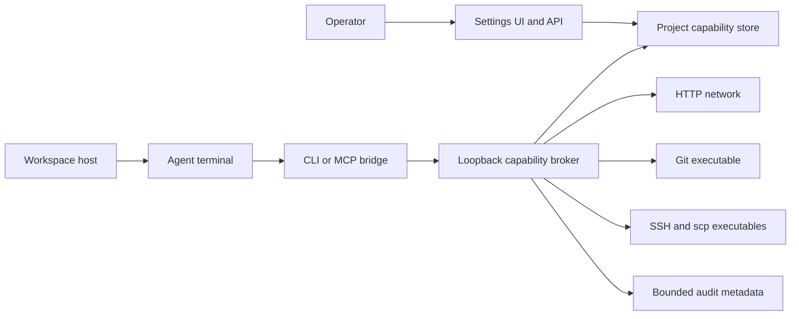

# p-track capability threat model

## Executive summary

Plan 4 adds a privileged host broker that can make HTTP requests and invoke Git, SSH, and scp for an agent. The dominant risks are authorization confusion across profiles or projects, scope escapes through redirects and paths, subprocess argument injection, bearer-token replay, and secret-bearing audit data. The implementation reduces these risks with host-minted generation-bound identities, exact normalized approval digests, authorization immediately before execution, fixed command shapes, canonical project paths, bounded output and concurrency, and metadata-only audits. The important residual boundary is explicit: p-track capabilities govern broker tools only; ordinary terminal processes are not an OS-level network sandbox. Interactive SSH shells are not exposed because the JSON/MCP broker transport cannot safely carry a terminal; attempted interactive-shell grants are rejected during normalization.

## Scope and assumptions

- In scope: `internal/capability`, capability records in `internal/model` and `internal/store`, the `ptrack capability` bridge in `internal/cli`, terminal identity injection and workspace fencing in `internal/gui` and `internal/terminal`, and the capability Settings UI in `frontend`.
- Runtime model: a single-user local desktop/CLI application launches agent profiles as child processes and exposes a random-port loopback broker for the active canonical project generation.
- Data sensitivity: remote repository contents, HTTP request and response data, filesystem transfers, Git credential-helper access, and current ssh-agent identities may be sensitive.
- Authentication expectation: a host-minted opaque bearer token represents one launched terminal's immutable project, generation, profile ID, and session. Caller-supplied profile names are not identity.
- Out of scope: ordinary shell/agent processes invoking network tools directly, OS firewall/sandbox enforcement, remote multi-user hosting, feature 7, and any Rust, Tauri, or Ghostty migration.
- The active plan and user instructions supply the service context, so no material deployment questions remain open. If p-track becomes a remote or multi-user service, token storage, process isolation, tenant separation, and loopback assumptions require a new threat model.

## System model

### Primary components

- The Settings API previews, stores, enables, disables, expires, and removes project-local grants (`internal/gui/capability_settings.go`, `PreviewCapabilityV2` and `EnableCapabilityV2`).
- The per-project Bolt database stores normalized grants and bounded audit metadata (`internal/store/capabilities.go`; `internal/store/store.go`, `bucketCapabilities`).
- The workspace owns a generation-scoped loopback broker and shuts it down with other project resources (`internal/gui/capabilities.go`; `internal/gui/workspace_context.go`, `runClose`).
- The host injects a fresh capability token before an agent profile starts and binds it to the resulting terminal session (`internal/gui/terminal.go`, `CreateTerminalV2`; `internal/terminal/manager.go`, `CreateWithEnv`).
- CLI and MCP clients discover the active project's private descriptor and forward typed tool calls to one broker dispatcher (`internal/cli/capability.go`; `internal/capability/mcp.go`; `internal/capability/broker.go`, `Call`).
- HTTP, Git, and SSH executors repeat authorization at use time and invoke host networking or direct subprocesses (`internal/capability/http.go`, `git.go`, and `ssh.go`).

### Data flows and trust boundaries

- Operator → Settings API: grant drafts and approval intent cross Wails bindings. Normalization produces the displayed effective scope and digest; enabling requires that exact digest. The API is generation-fenced.
- Host → agent child: an opaque token plus canonical project, generation, and immutable profile ID cross the process environment. The terminal manager validates environment keys and values before launch.
- Agent/MCP client → loopback broker: JSON or JSON-RPC tool name, capability ID, and typed arguments cross authenticated loopback HTTP or stdio. The broker rejects origins, non-POST requests, unknown fields, oversized frames, invalid or unbound tokens, and unknown tools.
- Broker → project database: capability IDs select project-local grants; the broker reopens the active project's database and does not accept a database path from the caller.
- Broker → HTTP network: transient URL, headers, and body cross the system proxy and CA trust path. Authorization checks method, exact normalized origin, segment-bounded path, request size, redirects, timeout, response size, and concurrency.
- Broker → Git/SSH/scp: typed operation fields become fixed executable/argument vectors without a local shell. Git re-reads repository and remote identity, then invokes the exact approved URL and head refs. SSH uses a pinned host key, ssh-agent-only authentication, exact commands/roots, bounded streamed downloads, and independently approved forwarding directions.
- Executors → audit store: allowlisted operation, sanitized target, outcome class, counts, and duration cross into persistent storage. Bodies, headers, tokens, raw stderr, credentials, and raw command arguments are absent from the audit type.

#### Diagram

## Assets and security objectives

| Asset | Why it matters | Security objective (C/I/A) |
| --- | --- | --- |
| Capability grants and approval state | Defines the exact authority delegated to an agent | I, A |
| Session bearer token | Possession permits use of grants for one agent session | C, I |
| Project files and Git working tree | Pull, push, upload, and download can change or disclose project data | C, I, A |
| Remote HTTP services and data | Requests may carry sensitive transient headers or bodies and cause writes | C, I |
| ssh-agent and Git credential helpers | Delegate external identity without p-track storing credentials | C, I |
| Audit metadata | Supports accountability but must not become a secret store | C, I, A |
| Broker and terminal availability | Unbounded work could exhaust the local application | A |

## Attacker model

### Capabilities

- A launched agent can control tool names and all typed request fields and can make concurrent, malformed, oversized, stale, or replayed requests.
- An approved remote HTTP service can return redirects, large or slow responses, and hostile headers or payloads.
- A project can contain hostile Git configuration, refs, symlinks, and paths; a remote Git/SSH endpoint can return hostile diagnostics.
- Another process running as the same OS user may try to read descriptors, copy a child token, or race project transitions. This is a meaningful residual risk because there is no same-user OS isolation.

### Non-capabilities

- There is no internet-facing inbound listener; the broker binds IPv4 loopback on a random port (`internal/capability/broker_server.go`, `StartBrokerServer`).
- A remote network attacker cannot directly read local process environments or the private runtime directory without another local compromise.
- The model does not treat the agent child as contained from invoking `curl`, `git`, or `ssh` itself. Such direct host operations are outside the capability enforcement boundary.

## Entry points and attack surfaces

| Surface | How reached | Trust boundary | Notes | Evidence (repo path / symbol) |
| --- | --- | --- | --- | --- |
| Settings mutations | Wails-bound GUI methods | Operator → host | Preview digest and generation required | `internal/gui/capability_settings.go`, `SaveCapabilityV2` |
| CLI helper | `ptrack capability call` | Agent → broker | Requires injected token and matching project descriptor | `internal/cli/capability.go`, `activeCapabilityClient` |
| MCP stdio | `ptrack capability mcp` | Provider → bridge | Bounded newline JSON-RPC and known tools only | `internal/capability/mcp.go`, `ServeMCP` |
| Loopback HTTP | `/v1/tools/list`, `/v1/tools/call` | Local process → broker | POST, no Origin, bearer auth, bounded strict JSON | `internal/capability/broker_server.go`, `accept` and `handleCall` |
| HTTP executor | `ptrack_http_request` | Broker → network | Per-hop origin/path reauthorization and response bounds | `internal/capability/http.go`, `Execute` |
| Git executor | `ptrack_git` | Broker → Git process | Fresh root/remote/rewrite checks and fixed operations | `internal/capability/git.go`, `Execute` |
| SSH/scp executor | `ptrack_ssh` | Broker → SSH process | Pinned key, agent-only auth, separate grants | `internal/capability/ssh.go`, `buildSSHProcess` |
| Project path resolution | upload/download fields | Project data → filesystem | Canonical root and nearest-existing-ancestor symlink checks | `internal/capability/policy.go`, `ResolveProjectPath` |
| Audit persistence | executor outcomes | Broker → database | Allowlisted, truncated, bounded metadata only | `internal/capability/audit.go`, `Recorder.Record` |

## Top abuse paths

1. Agent supplies another profile's capability ID → broker resolves identity from its host-minted token → exact profile mismatch denies before transport.
2. Agent replays a token after project switch → old broker is shut down and descriptor removed → new generation's token map rejects the token.
3. Approved HTTP server redirects to another host or path → redirect callback repeats authorization → second request is never sent outside scope.
4. Agent uses encoded traversal or a segment-prefix collision in a URL → canonical URL/path validation rejects the ambiguous request.
5. Hostile Git config changes a remote or adds `insteadOf` → executor re-reads configuration and denies before fetch/pull/push.
6. Agent injects shell syntax or leading options into Git/SSH fields → exact grant checks and fixed argument positions prevent unapproved data from reaching a runner.
7. Project symlink points an approved transfer root outside the project → canonical ancestor resolution detects the escape and denies before scp.
8. Agent races disable, expiry, session close, or project switch against an in-flight call → broker cancellation stops tracked work and subsequent authorization re-reads current grant state.
9. Remote response includes credentials or hostile diagnostics → only bounded transient output returns to the caller; audit persistence stores sanitized target and class only.

## Threat model table

| Threat ID | Threat source | Prerequisites | Threat action | Impact | Impacted assets | Existing controls (evidence) | Gaps | Recommended mitigations | Detection ideas | Likelihood | Impact severity | Priority |
| --- | --- | --- | --- | --- | --- | --- | --- | --- | --- | --- | --- | --- |
| TM-001 | Malicious agent or same-user process | Access to a live child token | Replay token from another process or after lifecycle change | Use approved remote authority | Token, remote data, project files | Random token hash, required binding, session/generation/project lifecycle revocation (`broker.go`, `IssueSessionToken`, `authenticate`) | A stolen live token is bearer authority; same-user processes are not isolated | Keep tokens per launch, short-lived through session lifecycle, never persist; revisit OS credential channels if multi-user | Count rejected tokens and calls after revocation without logging token material | Medium | High | Medium |
| TM-002 | Malicious agent | Knows another capability ID or project path | Spoof profile, cross project, or cross generation | Authorization bypass | Grants, project data | Immutable token identity, project-local DB, canonical descriptor, generation fencing (`broker.go`, `SessionIdentity`; `broker_server.go`, `ReadBrokerDescriptor`) | None within the stated local model | Preserve fail-closed profile discovery and add regression tests for every new client | Audit denied profile/class and stale-generation counts | Low | High | Medium |
| TM-003 | Agent plus hostile HTTP service | Operator approves a hostname and method | Redirect, encoded path, credentialed URL, oversized body/response, or DNS manipulation | SSRF-like access, data disclosure, local exhaustion | HTTP data, local availability | Exact normalized origin/path, no userinfo, per-hop authorization, system CA/proxy, byte/time/concurrency bounds (`normalize.go`; `http.go`, `Execute`) | Hostnames intentionally trust the host resolver; no IP-range pinning is claimed | For deployments with hostile DNS, add optional approved CIDR/resolved-IP constraints without breaking VPN/proxy use | Audit sanitized origin only, redirect count, denial class, and limits | Medium | High | High |
| TM-004 | Malicious project or agent | Git capability exists | Change remote/rewrite config or inject ref/options to widen Git action | Push to wrong remote, destructive ref update, hooks | Git tree, remote repository, credentials | Fresh canonical root/remote checks, rewrite rejection, empty hooks dir, fixed argv, prompt disabled, exact branch/ref/force/delete/tag grants (`git.go`, `Execute`) | Host Git and credential-helper security remain dependencies | Keep new operations typed; never add arbitrary argv or inherit repository hooks | Audit operation, remote name, stable result class | Low | High | Medium |
| TM-005 | Malicious project or agent | SSH capability exists | Inject command/options, escape transfer roots, abuse forwarding, or accept changed host key | Remote execution, file disclosure/write, network pivot | Project files, remote host, ssh-agent | Exact command allowlist, direct argv, pinned key, password off, project/symlink confinement, independent upload/download/forward grants, and rejection of unsupported interactive shells (`ssh.go`; `policy.go`) | Explicitly approved remote commands run through the remote shell by design | Keep command grants exact and forwarding loopback-only; do not infer one SSH grant from another | Audit operation, host/port, stable failure class | Low | High | Medium |
| TM-006 | Malicious agent | Live grant while operator edits or revokes | Race an operation against disable, expiry, token revocation, or project switch | Operation continues beyond intended window | Grants, remote/project integrity | Authorization at use, scope digest, expiry, tracked cancellation, workspace close fencing (`policy.go`, `Authorize`; `broker.go`, `RevokeCapability`; `workspace_context.go`) | A remote may have committed an action just before cancellation | Keep high-risk operations idempotent where possible and display current state clearly | Audit timestamps around disable/expiry and cancellation class | Medium | Medium | Medium |
| TM-007 | Remote service or agent | Causes secret-bearing inputs or diagnostics | Smuggle tokens, headers, bodies, query strings, stderr, or paths into persistent audit | Secret disclosure through project DB/UI | Credentials, audit store | Narrow audit type, sanitizer/allowlists, count bounds, raw-database canary tests (`model.go`, `CapabilityAudit`; `audit.go`) | Transient responses remain visible to the requesting agent | Keep audit schema additive-only for safe fields; require canary tests for every new field | Scan serialized audits for canary secrets in tests | Low | High | Medium |
| TM-008 | Malicious agent or remote | Can issue many slow/large operations | Exhaust goroutines, memory, subprocesses, or output buffers | Local denial of service | Broker availability | Request/frame/output/time/redirect/concurrency limits, process contexts, bounded store retention (`normalize.go`; `process.go`; `broker.go`, `track`) | Limits are per capability; multiple enabled grants can consume aggregate resources | Consider an additional broker-wide concurrency ceiling if real workloads show pressure | Track limit denials and concurrent active-operation high-water mark | Medium | Medium | Medium |
| TM-009 | User expectation mismatch | Agent terminal is launched normally | Agent bypasses broker and invokes host network tools directly | Operations occur without capability audit or scope checks | Remote/project data | UI and plan explicitly state broker-only boundary (`frontend/index.html`; p-track plan note) | No OS-level enforcement exists | Do not describe capabilities as a sandbox; pursue firewall/process isolation only as a separate feature | None reliable at broker layer for direct process networking | High | High | High |

## Criticality calibration

- Critical: unauthenticated remote code execution in the host, cross-user/tenant authorization bypass in a future remote deployment, or silent extraction of credential material without a prior local compromise.
- High: broker authorization bypass that enables unapproved HTTP/Git/SSH writes; project-root escape that reads or overwrites arbitrary host files; persistent credential/token leakage to audits.
- Medium: attacks requiring a malicious launched agent or same-user process that can use only already-approved authority; bounded local denial of service; lifecycle races with narrow timing and existing cancellation.
- Low: disclosure of non-secret tool schemas, noisy invalid-request failures, or denial paths requiring operator-approved exact hostile input with no scope expansion.

## Focus paths for security review

| Path | Why it matters | Related Threat IDs |
| --- | --- | --- |
| `internal/capability/normalize.go` | Defines canonical scope and approval digest inputs | TM-003, TM-004, TM-005 |
| `internal/capability/policy.go` | Central deny-by-default authorization and path confinement | TM-002, TM-003, TM-005, TM-006 |
| `internal/capability/broker.go` | Token authentication, dispatch, concurrency, and revocation | TM-001, TM-002, TM-006, TM-008 |
| `internal/capability/broker_server.go` | Loopback listener, descriptor validation, request bounds | TM-001, TM-002, TM-008 |
| `internal/capability/http.go` | Redirect, header, proxy, TLS, and response handling | TM-003, TM-007, TM-008 |
| `internal/capability/git.go` | Host subprocess shape and fresh repository identity | TM-004, TM-006, TM-008 |
| `internal/capability/ssh.go` | Host key/auth policy, file paths, commands, forwarding | TM-005, TM-006, TM-008 |
| `internal/capability/audit.go` | Persistent secret-exclusion boundary | TM-007 |
| `internal/gui/terminal.go` | Host-minted identity injection and session revocation | TM-001, TM-002, TM-006 |
| `internal/gui/workspace_context.go` | Project-generation cancellation and resource fencing | TM-002, TM-006 |
| `internal/store/capabilities.go` | Approval update semantics and bounded audit retention | TM-006, TM-007 |

## Quality check

- Covered Settings, CLI, MCP, loopback HTTP, database, HTTP, Git, SSH/scp, filesystem, terminal identity, and audit entry points.
- Represented every discovered runtime trust boundary in the abuse paths and threat table.
- Kept runtime behavior separate from test/build/release tooling; release workflows are outside this feature threat model.
- Reflected the user-supplied local deployment, explicit broker-only enforcement boundary, and excluded migration scope.
- Recorded the resolver/DNS trust and same-user bearer-token model as residual assumptions rather than claiming stronger isolation.
