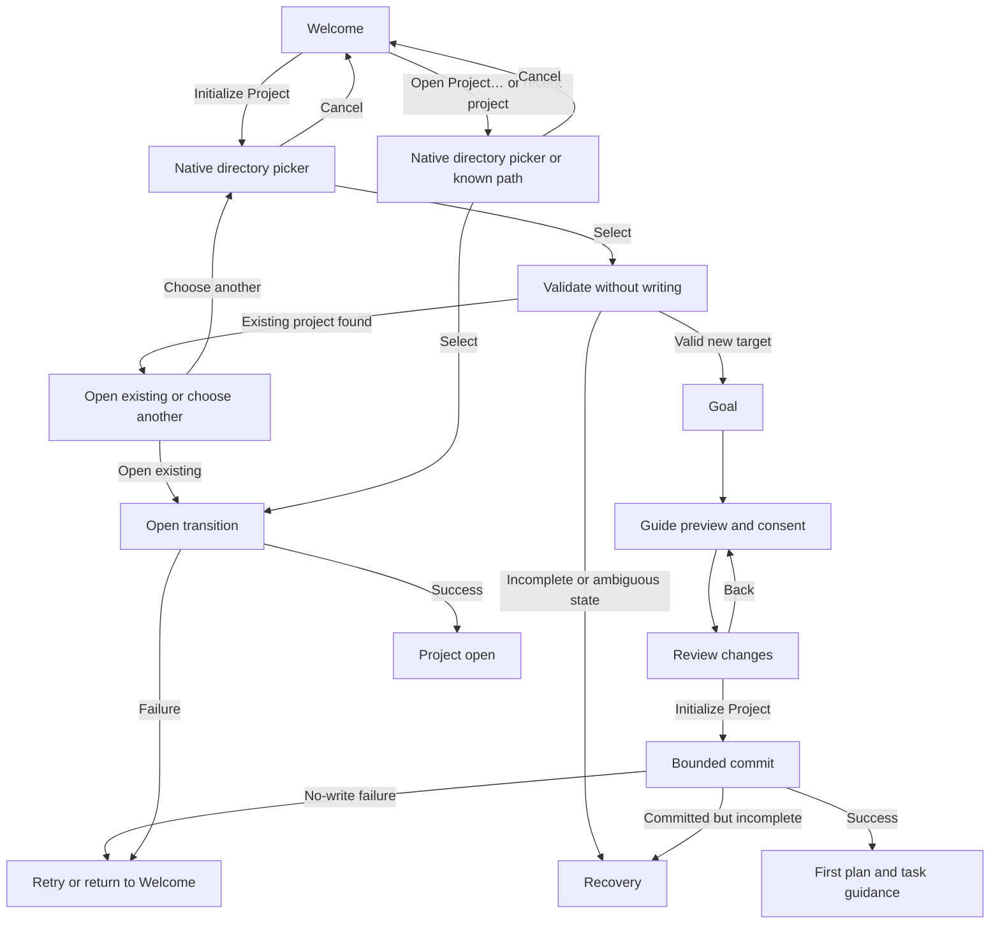

# p-track First-Run Welcome Design

**Status:** Ready for implementation
**Date:** 2026-08-14
**Owner:** ro-ag
**Backlog:** Plan #12, task #109

## Context

The desktop application can start without an open project, but its Welcome
screen currently assumes the selected directory is already initialized. A new
user sees only **Open Project…** and must leave the GUI to run `ptrack init`.

First run must make the two valid intentions explicit:

1. initialize p-track in a directory; or
2. open an existing p-track project.

The flow extends the durable workspace states defined by the project-workspace
design. It does not replace project discovery, generation fencing, or bounded
workspace cleanup.

## Goals

- Give Initialize and Open distinct, plainly worded entry points.
- Keep the user in the desktop application through initialization.
- Explain every proposed filesystem change before the first write.
- Make cancellation safe and unsurprising at every pre-commit step.
- Carry a successful initialization into goal, guide, plan, and task setup.
- Define keyboard, assistive-technology, error, and recovery behavior before
  implementation begins.

## Non-goals

- Implementing initialization bindings or frontend screens in this task.
- Changing the database format, project discovery rules, or CLI behavior.
- Automatically installing a project guide without preview and consent.
- Creating a plan or task without user confirmation.
- Adding accounts, cloud sync, telemetry, or any network dependency.
- Redesigning the application shell, navigation, brand, or general visual
  system.

## Experience principles

1. **Name the decision.** Initialize means create p-track project state; Open
   means use state that already exists.
2. **Preview before mutation.** Directory selection is not consent to write.
3. **One decision per screen.** Directory, goal, guide, and first work item are
   separate steps in the same bounded state surface.
4. **Preserve work on failure.** Never overwrite an existing or partially
   initialized project to make onboarding appear successful.
5. **Local by construction.** The flow reads and writes only local project
   state and explicitly previewed guide files.

## Welcome information architecture

Welcome remains inside the existing application shell and `.state-card`. It is
not a modal and does not place a second card around the whole experience. It
uses the current spacing, type, border, focus-ring, light/dark, and accent
tokens.

Content appears in this DOM and visual order:

1. eyebrow and heading;
2. one-sentence explanation;
3. primary **Initialize Project** button;
4. secondary **Open Project…** button;
5. a divided Recent projects section.

Use this exact initial copy:

| Element | Copy |
| --- | --- |
| Eyebrow | `p-track projects` |
| Heading | `Start with a project` |
| Detail | `Initialize p-track in a folder, or open a project you already use.` |
| Primary action | `Initialize Project` |
| Secondary action | `Open Project…` |
| Recent heading | `Recent projects` |
| Empty recents | `No recent projects yet.` |

The primary action is mint-accented. Open and recent-project actions retain the
existing secondary treatment. The hierarchy must remain clear without relying
on color.

## Journeys

### Initialize Project

1. **Initialize Project** opens the native directory picker.
2. Cancelling the picker returns to unchanged Welcome and restores focus to
   **Initialize Project**. It does not create a transition, candidate context,
   project registry entry, directory, or file.
3. A selected directory is canonicalized and validated without mutation.
4. If discovery finds an existing p-track project at or above the selection,
   show its canonical root and offer **Open Existing Project** or **Choose
   Another Folder**. Initialization is not offered for that selection.
5. If validation finds incomplete or ambiguous p-track state, enter Recovery;
   do not overwrite, delete, or silently repair it.
6. For a valid new target, collect the north-star goal. The goal is required,
   trimmed, limited to 4,096 UTF-8 bytes, and shown again on Review.
7. Offer project-guide installation as an explicit choice. Show the exact
   target files and proposed additions or diffs before consent. The default is
   no change when consent has not been given.
8. Review shows the canonical root, goal, guide choice, and complete filesystem
   change summary. **Initialize Project** on Review is the first mutating
   action.
9. During commit, inputs are inert and the status is announced. The frontend
   must not report cancellation after mutation begins; it waits for the bounded
   result.
10. Success reloads and installs the process's runtime authority, publishes the
    new workspace once, and advances to first plan/task guidance. The user may
    skip that guidance and enter the empty project.

### Open Project

1. **Open Project…** opens the existing native directory picker.
2. Picker cancellation is a no-op and restores focus to the invoking button.
3. The selected directory is resolved to a canonical registered project root
   before the current generation-safe Open Project transition. The existing
   desktop Open command accepts only exact registered roots, so task #110 must
   use the validation seam to resolve a selected descendant upward and pass
   the returned exact root to Open; it must not silently broaden the command's
   authority.
4. Success focuses the published project heading. Failure keeps the app in a
   recoverable no-project state with **Try Again** and **Choose Another
   Folder**; it never falls through into initialization.
5. Opening a recent project uses this same path and error behavior.

## Interaction state machine

The existing backend workspace vocabulary remains `welcome`, `loading`,
`open`, `error`, and `closed`. The initialization steps are frontend flow state
until commit; they do not allocate a workspace generation.

Back is available on Review and every earlier form step, returns to the prior
step heading, and preserves entered values. **Cancel Setup** from any
pre-commit step returns to Welcome after a confirmation only when the user has
entered data; otherwise it returns immediately. Escape closes only the current
native picker or confirmation dialog. It does not abandon an in-progress
commit.

## Validation and safety contract

Backend validation is authoritative even when the frontend has already shown
a valid result. Immediately before commit it must revalidate:

- the target exists and is a directory;
- the canonical target is stable and writable;
- discovery does not resolve an existing p-track project;
- the target does not contain incomplete, ambiguous, or incompatible p-track
  state;
- the trimmed goal is non-empty and no more than 4,096 UTF-8 bytes;
- the proposed guide writes still match the previewed base content; and
- the request contains no unpreviewed write.

The final review must distinguish:

- project storage that p-track will create;
- guide files that will be added or changed, when explicitly accepted; and
- files that will not be touched.

No credentials, tokens, terminal contents, Git operations, network calls, or
agent launches are part of initialization. Final Review authorizes this
ordered, recoverable mutation sequence:

1. **Authority quiesced** — fence new authority-dependent operations, drain
   admitted calls, drop every strong reference to the old `ActiveRuntime` and
   its shared cutover lease, then acquire the exclusive activation lease. This
   phase makes no durable change; failure restores the prior authority.
2. **Prepared** — publish the bootstrap recovery plan.
3. **Runtime committed** — create or validate the global and
   project-generation stores and install the active-generation marker.
4. **Project committed** — open the project-generation store created by the
   prior checkpoint, persist the goal, and attempt best-effort recent-project
   registration. It must not run a second create operation.
5. **Guide applied** — apply only the guide changes whose base and preview
   still match; guide failure does not erase the committed project.
6. **Desktop bound** — release the exclusive activation lease, load the new
   shared-lease `ActiveRuntime`, and atomically install the authority used by
   the workspace factory, recents provider, and update service; only then
   construct and publish the workspace generation.

These checkpoints reflect the existing bootstrap ordering and must be durable
or derivable. Task #110 must add an idempotency/reconciliation key and a status
query so a lost frontend response can discover the last completed checkpoint.
Repeating a request resumes or reports that same operation; it never blindly
replays writes. A failure before **Prepared** is a safe no-write failure. A
failure after **Runtime committed** is a committed initialization requiring
resume or rebind, not a failure that can be retried from scratch.

The desktop currently constructs its factory, recents provider, and update
service from one startup-time `ActiveRuntime`, including an unavailable
configuration on true first run. Task #110 must introduce one reloadable,
atomic runtime-authority owner inside the durable desktop runtime. That owner
must control all strong references held by the workspace factory, recents
provider, and update service so quiescing actually releases the old shared
cutover lease. No workspace may be published until the newly loaded authority
is installed; a rebind failure enters Recovery and must also reconcile
correctly after restart.

## Recent projects

Recent projects remain newest first and bounded by the existing registry
contract. Available rows show name, canonical path, relative last-opened time,
and **Open**.

Unavailable entries must not disappear silently once task #114 exposes enough
status to distinguish them:

- missing paths show `Folder not found` with **Locate…** and **Forget**;
- permission failures show `Permission required` with **Try Again** and
  **Forget**; and
- an entry that now resolves to a different project requires confirmation
  before its registry path changes.

Locating or retrying uses Open semantics. Forget removes only the recent entry,
never project files. Until #114 is implemented, the existing filtering of
unavailable entries may remain.

## Accessibility contract

- Initial Welcome focus lands on **Initialize Project**. Returning from a
  cancelled Open picker restores **Open Project…** instead.
- The heading is programmatically focusable. Step changes move focus to the
  new heading; field validation moves focus to the first invalid control.
- DOM and Tab order match the information architecture. All actions work with
  Enter and Space; no single-letter shortcut runs during onboarding.
- Each step has an accessible name and progress text such as `Step 2 of 4`.
  Progress is text, not color alone.
- Async validation and commit set `aria-busy`; concise status changes use a
  dedicated polite live region. Errors use an assertive announcement once and
  keep their visible text available for review.
- Confirmation dialogs trap focus, close on Escape when cancellation is safe,
  and restore the invoking control.
- Native pickers retain operating-system keyboard and screen-reader behavior.
- Reduced-motion mode removes nonessential transitions and animated progress.
  A textual status remains visible.
- Light, dark, forced-colors, and high-contrast modes retain visible focus,
  borders, labels, and action hierarchy. Icons, when used, supplement text.

## Error and recovery states

| Condition | User-facing response | Safe actions |
| --- | --- | --- |
| Directory vanished or became unreadable before commit | `This folder is no longer available.` | Try Again; Choose Another Folder; Cancel Setup |
| Existing project discovered | Show canonical existing root | Open Existing Project; Choose Another Folder |
| Goal invalid | Inline reason, entered text preserved | Edit goal |
| Guide preview stale | `The guide file changed since preview.` and refreshed diff | Review Again; Skip Guide; Cancel Setup |
| Initialization failed before `Prepared` | Plain error with no success claim | Try Again; Return to Welcome |
| Runtime or project committed but setup incomplete | Name the last durable checkpoint and preserved project | Resume Setup; Open Project; Recovery Help |
| Partial or ambiguous project state | Name the affected path; do not auto-repair | Open Recovery Help; Choose Another Folder; Return to Welcome |
| Opening failed | Preserve selected path and error | Try Again; Choose Another Folder; Return to Welcome |
| Backend unavailable | Keep local form values in memory only | Try Again; Return to Welcome |

Retry reruns authoritative validation. It never replays a write solely because
the frontend did not receive a response. Recovery Help may explain a manual or
future guided recovery path, but cannot offer destructive cleanup by default.

## Guide capability and post-commit onboarding

Guide preview and publication are capability-gated. On platforms where secure
descriptor-relative preview and publication are unavailable, the guide step
states `Project guidance is not available on this platform yet`, selects
**Skip Guide**, and allows initialization to continue. Task #112 may remove
that fallback only by adding an equivalent fail-closed publisher and tests for
the platform; it may not substitute path-based writes.

First plan and first task are separate post-project commits:

1. The plan form creates and activates the plan. **Skip for Now** opens the
   empty project and focuses the project heading.
2. After plan creation, the task form creates the task, then explicitly starts
   it when the user chose that option.
3. If task creation fails, the created plan remains active; preserve the task
   input and offer **Try Again** or **Finish with Plan**. The latter opens the
   board and focuses the plan heading.
4. If starting fails after task creation, keep the task in `todo`, explain that
   outcome, and offer **Try Starting Again** or **Finish Setup**.
5. Closing or leaving onboarding after **Project committed** never presents a
   pre-commit cancellation claim and never rolls back project, plan, or task
   state. Returning opens the committed project at the last durable step.

## Privacy and observability

This flow has no telemetry. Validation, previews, goals, paths, and errors stay
local. Logs may record state names and typed error categories, but must not log
goal text, file contents, credentials, or full user paths unless the existing
explicit diagnostics export already redacts and governs them.

## Acceptance criteria for task #109

- Welcome presents Initialize and Open as distinct choices with the exact copy
  and hierarchy in this document.
- Initialize has a complete path from picker through review, commit, and first
  plan/task guidance.
- Open and recent projects retain exact-root backend authority and
  generation-safe transition semantics; selected descendants are resolved by
  validation before Open is invoked.
- Every picker, Back, Cancel, error, retry, partial-state, and success outcome
  has a defined state and focus destination.
- No filesystem mutation occurs before the final Review confirmation.
- Guide changes require an exact preview and explicit opt-in.
- Accessibility, reduced-motion, high-contrast, privacy, and no-telemetry
  requirements are testable.
- The implementation boundaries below assign all remaining behavior to Plan
  #12 tasks without hiding work in this design task.

## Implementation map

| Task | Responsibility |
| --- | --- |
| #110 | Directory picker/validation, exact-root resolution, typed checkpoint/status results, idempotent bounded initialization command, reloadable runtime authority, and desktop allowlist |
| #111 | Required trimmed goal field, 4,096-byte backend bound, review, and persistence |
| #112 | Capability-gated exact guide diff/preview, stale-base detection, fail-closed publication, explicit consent, and unavailable-platform path |
| #113 | Separate plan/task commits, partial-success recovery, skip paths, focus destinations, and workspace handoff |
| #114 | Missing-path and permission-aware recent-project recovery and Forget behavior |
| #115 | Empty, error, cancellation, retry, stale preview, backend loss, and partial-state UI |
| #116 | Keyboard, screen-reader, reduced-motion, forced-colors, zoom, and contrast acceptance |
| #117 | End-to-end first launch, new project, existing project, cancellation, retry, and recovery smoke tests |

Primary implementation anchors:

- `frontend/index.html` — Welcome/state-screen markup;
- `frontend/src/workspace/presentation.ts` — workspace copy;
- `frontend/src/app.js` — state rendering, recents, pickers, and transitions;
- `frontend/src/style.css` — existing state-card and design tokens;
- `crates/ptrack-app/src/desktop_runtime.rs` — durable desktop dispatch and
  workspace state;
- `crates/ptrack-app/src/service.rs` — `InitRequest` and initialization service;
- `crates/ptrack-app/src/production.rs` — production project bootstrap and
  recoverable initialization primitives;
- `src-tauri/src/main.rs` — native pickers and startup/runtime authority
  construction; and
- `frontend/src/tauri-bridge.js` — frontend command exposure.

The implementation must extend these seams rather than introduce a second
frontend state framework or a parallel initialization service.
